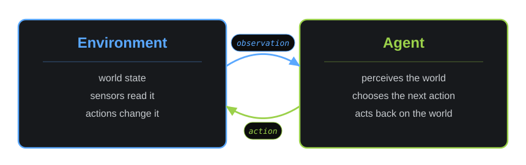
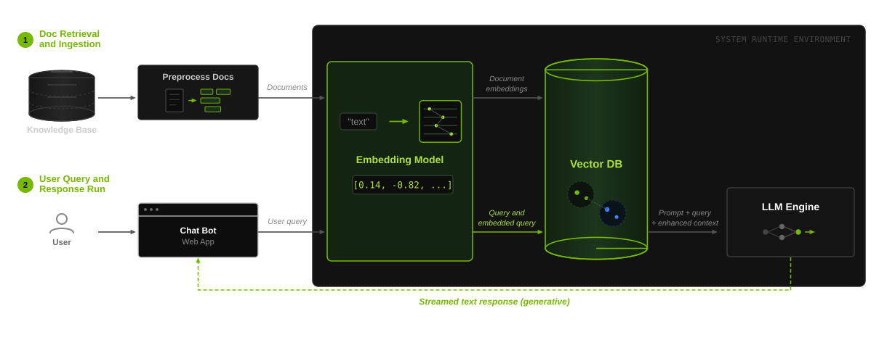
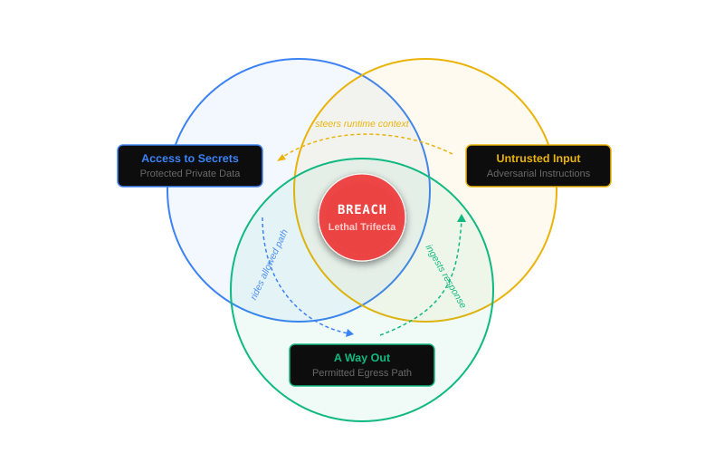

# Securing Agents with OpenShell and NemoClaw

> Go from one model call to coordinated agents, grounded retrieval, deep planning, and safer execution. NemoClaw provides the reference stack; OpenShell provides the sandbox.

| Start learning | Prepare the lab | Access models |
| --- | --- | --- |
| **[Open the course][course]** | **[Launch NemoClaw on Brev][brev-launchable]** | **[Open NVIDIA Build][nvidia-build]** |
| Work through the four modules. | Keep it running for the live-agent exercises. | Create an API key when prompted. |

[course]: https://nvdli.github.io/NemoClawDLI/nemoclaw/
[brev-launchable]: https://brev.nvidia.com/launchable/deploy?launchableID=env-3Azt0aYgVNFEuz7opyx3gscmowS&ncid=ref-dli-759990
[nvidia-build]: https://build.nvidia.com/?ncid=ref-dli-146986

[](https://github.com/NVDLI/NemoClawDLI/actions/workflows/pages.yml?query=branch%3Amain)
[](https://github.com/NVDLI/NemoClawDLI/actions/workflows/codeql.yml?query=branch%3Amain)
[](LICENSE)

## About the course

Modern agents are everywhere, and they’re conceptually simple: a model wired to tools, memory, and a routing decision that keeps running until the task is done. This course starts by building such a system from scratch, then connects those ideas to modern frameworks used by software engineers and non‑technical users alike. You’ll go from a single API call to agent coordination, grounded retrieval, deep planning, and safe deployment using NVIDIA OpenClaw and NemoClaw™.

Every lesson is an editable browser exercise. Later modules use NemoClaw to bootstrap a working agent and OpenShell to inspect what it may access.

> [!NOTE]
> This repository releases the course and validation tools. NemoClaw and its runtime remain external dependencies.

## Course path

### Module 1: build the agent loop



Start with the observation-action loop. Add model calls, state, tools, and a clear stop condition.

### Module 2: coordinate and ground the work



Add explicit routing, parallel work, retrieval over your own sources, and deeper planning.

### Modules 3 and 4: run and constrain the agent



Connect the design to NemoClaw, keep an agent running, then use OpenShell to constrain tools, files, and network access.

## What you will learn

- Build a basic agent loop and identify its core components.
- Implement reliable tool use and function calling within an agent system.
- Design and coordinate multi-agent systems using structured routing patterns.
- Utilize OpenShell to configure agent identities and ensure safe, sandboxed operations.
- Deploy and manage autonomous agents while building persistent skill libraries.

## Take the course

1. Open the **[GitHub Pages course][course]** and work through Module 1.
2. Start the **[NemoClaw Brev launchable][brev-launchable]** before Module 3, where the exercises drive a live agent.
3. Open **[NVIDIA Build][nvidia-build]** and create an API key when a lesson asks for one.
4. Run the supplied examples, inspect their behavior, and change one input at a time.

The static browser site is available in **[English][course]**, **[Spanish](https://nvdli.github.io/NemoClawDLI/es/nemoclaw/)**, and **[Brazilian Portuguese](https://nvdli.github.io/NemoClawDLI/pt/nemoclaw/)**. Its canonical entrypoint is the [course source](web/nemoclaw/index.html).

## Run the course locally

Install Python 3.11+, Bash, Node.js 20+, pnpm through Corepack, and Chromium. Python 3.12 is the tested default.

```bash
git clone https://github.com/NVDLI/NemoClawDLI.git
cd NemoClawDLI
bash scripts/build/build_pages.sh public
python3 -m http.server -d public 8000
```

Open `http://localhost:8000/nemoclaw/`. Before installing Python packages, run `python3 scripts/runtime/python_env_probe.py`, use a virtual environment, and install the applicable pinned lock.

## Contribute

Corrections, teaching ideas, runtime observations, and source leads are welcome through [Issues](https://github.com/NVDLI/NemoClawDLI/issues). Broader questions belong in [Discussions](https://github.com/NVDLI/NemoClawDLI/discussions).

Start with [`CONTRIBUTING.md`](CONTRIBUTING.md). Each patch needs an Issue, declared blast radius, validation evidence, and DCO signoff. See the [`Code of Conduct`](CODE_OF_CONDUCT.md), [`support policy`](SUPPORT.md), and [`DCO`](DCO.md).

> [!IMPORTANT]
> Report security issues through [`SECURITY.md`](SECURITY.md). Do not place vulnerabilities, credentials, or access sessions in a public Issue or Discussion.

## Verify a change

```bash
bash scripts/build/install-hooks.sh
python3 scripts/validation/release_gate.py --tier fast --no-write
```

Use `--tier ship` before release or after a cross-cutting contract change. The [`release test plan`](docs/release-test-plan.md) maps claims to evidence; browser setup lives in [`docs/lab_runtime_testing.md`](docs/lab_runtime_testing.md).

Code remains an untrusted proposal until checks and an authorized reviewer accept it. No contributor, maintainer, or agent may approve its own protected merge or release, and approval does not replace a missing control.

## Agent guidance

[`AGENTS.md`](AGENTS.md) is the cross-harness contract. Directory-level `SKILL.html` beacons route people and agents to the relevant files and checks. The compliance suite supports review; it does not replace required security, license, review, or release controls.

## Repository map

| Path | Purpose |
| --- | --- |
| [`web/`](web/SKILL.html) | Browser course, runtime, figures, materials, and dependency evidence |
| [`i18n/`](i18n/SKILL.html) | Reviewed Spanish and Brazilian Portuguese overlays |
| [`scripts/`](scripts/SKILL.html) | Build, validation, runtime, compliance, and material tooling |
| [`docs/`](docs/SKILL.html) | Design, test, deployment, security, and release contracts |
| [`SKILL.html`](SKILL.html) | Repository-wide map |

The [`Rapidly-Evolving Agentic Compliance Suite`](docs/agentic-compliance-suite.md) design note explains the repository’s workflow pattern and limits.

<details>
<summary><strong>Security, dependencies, and release integrity</strong></summary>

The threat model lives in [`docs/security-design.md`](docs/security-design.md). The [`browser dependency inventory`](web/nemoclaw/dependencies.html), [`THIRD_PARTY_LICENSES.md`](THIRD_PARTY_LICENSES.md), and [`THIRD-PARTY-NOTICES.md`](THIRD-PARTY-NOTICES.md) distinguish shipped code, tools, and sourced materials.

</details>

## Governance and license

This NVIDIA-owned DLI course repository is approved for public release as a Full-OSS-Project, OSS Type I. That classification does not apply to the NemoClaw product.

[`RELEASE_STATUS.json`](RELEASE_STATUS.json) records the public-safe release state. [`docs/release_playbook.md`](docs/release_playbook.md) owns maintainer roles and publication; [`CHANGELOG.md`](CHANGELOG.md) records version history.

The project uses the [Apache License 2.0](LICENSE). Contributions use the same inbound license with DCO signoff; no separate CLA is required.
