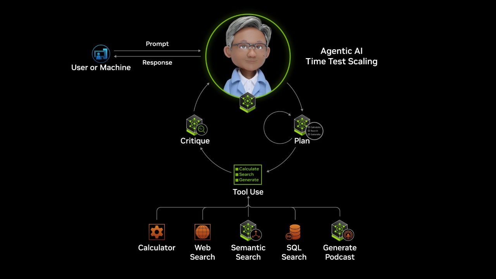

# [What are AI Agents?](https://www.nvidia.com/en-us/glossary/ai-agents/)

# Autonomous AI Agents

Autonomous agents are advanced AI systems that reason, plan, and execute multi-step tasks based on a goal, built with security, privacy, and policy controls to make them safer to develop and deploy.

## What Are AI Agents?

Autonomous AI agents are the new digital workforce—working for and with us. They represent the next evolution in [artificial intelligence](https://www.nvidia.com/en-us/glossary/artificial-intelligence/), transitioning from simple automation to autonomous systems capable of managing complex workflows within defined security and governance boundaries. These agents not only automate repetitive and time-consuming tasks but also empower individuals and organizations to operate more efficiently by acting as intelligent personal assistants.

Unlike traditional [generative AI](https://www.nvidia.com/en-us/glossary/generative-ai/) models that follow a basic “request-and-respond” framework, autonomous agents are systems of AI models that orchestrate and collaborate with other agents and utilize tools such as [large language models](https://www.nvidia.com/en-us/glossary/large-language-models/) (LLMs), [retrieval augmented generation](https://www.nvidia.com/en-us/glossary/retrieval-augmented-generation/) (RAG), [vector databases](https://www.nvidia.com/en-us/glossary/vector-database/), APIs, frameworks, and high-level programming languages like Python.

These agents rely on secure infrastructure layers, such as sandboxes, identity controls, and policy engines, to manage tool access and protect sensitive data as they work—all while requiring minimal human input and operating within permissions set by users and enterprise policies.

For example, an autonomous agent tasked with building a website could autonomously manage tasks like layout design, writing HTML and CSS code, connecting backend processes, generating content, and debugging.

Consent for Optional Cookies

(googleCookiePolicyLink)YouTube sets performance, advertising, and other optional cookies(/googleCookiePolicyLink) when you watch embedded videos. To watch this video, you need to turn on optional cookies for the site. By clicking “Accept and Play Video,” you will automatically turn on advertising and other optional cookies for the site and accept our (nvidiaTermsOfServiceLink)Terms of Service(/nvidiaTermsOfServiceLink) (which contains important waivers). Please see our (nvidiaPrivacyPolicyLink)Privacy Policy(/nvidiaPrivacyPolicyLink) and (nvidiaCookiePolicyLink)Cookie Policy(/nvidiaCookiePolicyLink) for more information.

Cancel

Accept and Play Video

Alternatively, you can (youtubeLink)watch this video on YouTube(/youtubeLink).

How an agentic AI pipeline works

## What Are the Components of an AI Agent?

To understand how AI agents operate, it’s crucial to examine their core components. These components work in tandem to enable agents to reason, plan, and execute tasks effectively and securely.

- **LLM:**The “brain” of the AI agent, an LLM is responsible for coordinating decision-making. It reasons through tasks, plans actions, selects appropriate tools, and manages access to necessary data to achieve objectives. The agent core is where the agent’s overall goals and objectives are defined and orchestrated. In enterprise settings, this core works within guardrails and policy constraints so the agent’s actions align with business and security requirements.
- **Memory Modules:** AI agents rely on memory to maintain context and adapt to ongoing or historical tasks.
- **Planning Modules:**Planning modules enable AI agents to break down complex tasks into actionable steps
  - **Without Feedback**: Uses structured techniques like “Chain of Thought” or “Tree of Thought” to decompose tasks into manageable steps.
  - **With Feedback:** Incorporates iterative improvement methods like ReAct, Reflexion, or human-in-the-loop feedback for refined strategies and outcomes.
- **Tools:** AI agents can serve as tools themselves, but they also extend their capabilities by integrating with external systems such as APIs, databases, and RAG pipelines.
  - **APIs**: Access real-time data or execute actions programmatically.
  - **Databases and RAG pipelines**: Retrieve relevant information and ensure accurate knowledge bases.
- **Systems of Models:** [Open source](https://developer.nvidia.com/open-source?sortBy=open_source_projects%2Fsort%2Ftitle%3Aasc) models, like [NVIDIA Nemotron](https://www.nvidia.com/en-us/ai-data-science/foundation-models/nemotron/) and [world foundation models](https://www.nvidia.com/en-us/glossary/world-models/) such as [NVIDIA Cosmos](https://www.nvidia.com/en-us/ai/cosmos/), enable developers to customize models for their own use cases, while frontier models offer state-of-the-art performance across a wide range of tasks. Working together, these models enable agents to deliver high accuracy, controlled cost, and better management of data security and privacy.

## How Do AI Agents Work?

Autonomous AI agents seamlessly combine their core components to tackle complex tasks while staying within security, privacy, and policy constraints defined by their environment. Below is an example illustrating how these components work together in response to a specific user request.

**Example Prompt**: *Analyze our latest quarterly sales data and provide a graph.*

#### **Step 1. User or Machine Request**

A user, or even another agent or system, initiates the agent’s workflow by requesting an analysis of sales data and a visual representation. The agent processes this input and decomposes it into actionable steps. As they decompose the request into actionable steps, agents also check what data and tools they are permitted to access.

#### **Step 2. The Reasoning Model: Interpreting the Task**

The Reasoning Model evaluates available data and tool requirements to understand, then plans actions that respect policies, such as which systems the agent can query or modify.

Some of the steps might include:

- **Fetch:** Retrieve targeted data (e.g., pulling sales figures from the database).
- **Analyze:** Apply logic and algorithms to extract meaningful trends.
- **Visualize:** Use tools to generate professional graphs to present the final insights.
- **Guard and Enforce:** Apply security, privacy, and governance rules at each step so the agent only performs approved actions on authorized data.

**Step 3. Memory Module: Providing Context**

The memory module ensures context is preserved for efficient task execution.

- **Short-term memory:** Tracks the context of the current workflow, such as similar tasks requested last quarter, to streamline the process.
- **Long-term memory:** Retains historical knowledge, like the database location or preferred analysis methods, enabling deeper contextual understanding.

#### **Step 4. Tool Integration: Performing the Task**

The agent core orchestrates external tools to complete each step.

- **APIs:** Retrieve raw sales data.
- **Machine learning algorithms:** Analyze data for trends and patterns.
- **Code interpreter:** Generates the graph based on the analysis results.

#### **Step 5. Reasoning and Reflection: Improving Outcomes**

Throughout the process, the agent applies reasoning to refine its workflow and enhance accuracy. This includes:

- Evaluating the effectiveness of each action.
- Ensuring efficient use of tools and resources.
- Learning from user feedback to enhance future tasks.

For example, if the generated graph needs refinement, the agent adapts its approach to deliver better results in subsequent workflows.

### Why Reasoning Matters

The reasoning layer is a defining feature of agentic AI, enabling agents to think about how they achieve their goals. By combining LLM capabilities with tools like APIs, orchestration software, and contextual memory,  reasoning empowers agents to navigate complex environments with precision and efficacy. This adaptability makes AI agents invaluable for automating and optimizing intricate workflows.

### Why Guardrails Matter for Autonomous AI Agents

The more capable agents become, the harder they are to trust. Because autonomous AI agents run for long periods and have access to both online and local data, they require strong safety and privacy guardrails. These include sandboxing, policy engines, and privacy routers for network and data access management, as well as policy enforcement at the infrastructure layer—not just inside the agent code. Together, these guardrails help organizations safely build and deploy autonomous agents in production.

## What Are the Different Kinds of AI Agent Frameworks?

AI agents can be written directly in Python, especially for simple workflows and experimentation. When moving to more complex workflows or production environments, telemetry, logging, and evaluation become important, and agent frameworks become helpful. AI agent frameworks are specialized development platforms or libraries designed to simplify the process of building, deploying, and managing AI agents. These frameworks abstract much of the underlying complexity of creating agentic systems, allowing developers to focus on specific applications and agent behaviors rather than the technical details of implementation.

When choosing an AI agent framework, it’s important to consider factors such as:

- **Multi-agent collaboration:** Does the project require multiple agents working together?
- **Project complexity:** Is the framework suitable for simple tasks or complex workflows?
- **Data handling:** Does the framework support necessary data integration and retrieval?
- **Customization needs:** How much flexibility is needed for tailoring the agent’s behavior?
- **LLM emphasis:** Does the framework prioritize working with large language models?

Depending on these requirements, a range of frameworks exists to suit different use cases and levels of complexity.

There are many ways to implement AI agents—for example, bring your own Python, LangChain, and Llama Stack. These frameworks can leverage open models, like [NVIDIA Nemotron](https://www.nvidia.com/en-us/ai-data-science/foundation-models/nemotron/), as well as [frontier models](https://www.nvidia.com/en-us/glossary/frontier-models/) for enhanced agentic capabilities.

## What Are the Types of AI Agents?

AI agents can be classified based on their complexity, decision-making processes, and adaptability to their environment. Below are the key types of AI agents, ranging from simple systems to highly intelligent and adaptive frameworks:

| **Type of Agent** | **Key Characteristics** | **Use Case Example** |
| --- | --- | --- |
| **Simple Reflex** | Acts based on current perceptions and predefined rules  No memory or adaptability | Thermostat self-adjusting temperature based on sensor input |
| **Model-Based Reflex** | Maintains short-term memory or a model of the environment, actions guided by rules | Navigation system updating routes based on traffic conditions |
| **Goal-Based** | Acts based on current perceptions and predefined rules  No memory or adaptability | Delivery robot optimizing its route to a destination |
| **Hierarchical** | Multi-tiered system with higher-level agents managing specialized agents | Factory automation system operating with supervisors and specialized bots |
| **Learning** | Learns and adapts through feedback and experience  Leverages learning components | AI recommendation system improving suggestions over time |
| **Multi-Agent Systems (MAS)** | Collaborates with other agents to achieve common goals  Works in coordinated systems | Fleet of drones coordinating to deliver packages |
| **Utility-Based** | Optimizes outcomes by maximizing utility or rewards for each action | Dynamic pricing algorithms adjusting rates based on market conditions |

## What Is AI Agent Orchestration?

| **Orchestration Type** | **Description** | **Advantages** | **Challenges** | **Use Case Example** |
| --- | --- | --- | --- | --- |
| **Centralized** | A single supervisor agent coordinates tasks, data flow, and decision-making | Clear control  Simplified management  Consistency in decisions | Potential bottlenecks  Less adaptable to dynamic systems | Customer Relationship Management (CRM) |
| **Decentralized** | Each agent operates autonomously, sharing information with others | High flexibility  Adaptable to dynamic environments | Requires sophisticated communication protocols  Higher complexity | Swarm drones for real-time deliveries |
| **Federated** | Multiple agent systems collaborate across organizations with shared protocols | Facilitates cross-system collaboration  Leverages system strengths | Relies heavily on interoperability and shared standards | Supply chain collaboration between firms |
| **Hierarchical** | Higher-level agents supervise lower-level agents in a tiered structure | Balances flexibility and oversight  Ideal for complex systems | Coordination across layers can be complex  Potential dependency delays | Industrial automation with layered control |

AI agent orchestration refers to the process of enabling multiple agents or tools that would typically operate independently to work together toward a common goal. This coordination allows the system to manage and execute more complex tasks efficiently.

Think of orchestration as a control framework for multi-agent systems. Orchestration is foundational for achieving scalability, efficiency, and adaptability in multi-agent systems. By enabling agents to collaborate and share resources effectively, orchestration supports:

- **Dynamic problem-solving:** Adapting to changing conditions or unexpected challenges.
- **Improved resource utilization:** Optimizing how agents access and use tools and data.
- **Enhancing system reliability:** Reducing conflicts and ensuring consistent outcomes.

This capability makes orchestration critical for industries such as logistics, autonomous systems, cybersecurity, and enterprise automation, where seamless multi-agent collaboration is a key to success.

## How Are AI Agents Different From AI Assistants?

| **Feature** | **AI Assistants** | **AI Agents** |
| --- | --- | --- |
| **Purpose** | Simplify tasks based on user commands | Solve complex, multi-step, goal-driven tasks autonomously |
| **Task Complexity** | Low to moderate | Moderate to high |
| **Interactivity** | Reactive | Proactive |
| **Autonomy** | Low:  Relies on human guidance | High:  Independent  Based on planning and reasoning |
| **Learning Ability** | Low:  Minimal, if any | High:  Learns from interactions and adapts over time |
| **Integration** | High:  But limited to specific applications | Extensive:  Includes APIs, databases, and tools |

AI agents and AI assistants differ significantly in their capabilities, autonomy, and the complexity of tasks they can handle.

[AI assistants](https://www.nvidia.com/en-us/glossary/virtual-assistant/) are an evolution of traditional AI chatbots. They use [natural language processing](https://www.nvidia.com/en-us/glossary/natural-language-processing/) (NLP) to understand user queries in the form of text or voice and perform tasks based on direct human instruction. These systems, such as Apple’s Siri, Amazon’s Alexa, or the Google Assistant, excel at handling predefined tasks or responding to specific commands.

AI agents represent a more advanced form of AI that extends beyond the capabilities of assistants. They leverage planning, reasoning, and contextual memory to tackle complex, open-ended tasks autonomously. AI agents can perform iterative workflows, utilize a broad set of tools, and adapt based on feedback and prior interactions.

## What Are AI Agent Use Cases?

The potential use cases of AI agents could be basically infinite. Deploying AI agents will be a matter of imagination and expertise, spanning from simpler use cases like generating and distributing content to complex use cases like orchestrating enterprise software and database functionality.

### Task Execution

A [task execution agent](https://developer.nvidia.com/blog/build-an-llm-powered-api-agent-for-task-execution/), which could also be called an “API agent” or an “execution agent,” can carry out a task requested by a user by using a set of predefined executive functions.

**Example**: “Write me a social media post to market our latest product and be sure to mention it’s on sale and now comes in green.”

Consent for Optional Cookies

(googleCookiePolicyLink)YouTube sets performance, advertising, and other optional cookies(/googleCookiePolicyLink) when you watch embedded videos. To watch this video, you need to turn on optional cookies for the site. By clicking “Accept and Play Video,” you will automatically turn on advertising and other optional cookies for the site and accept our (nvidiaTermsOfServiceLink)Terms of Service(/nvidiaTermsOfServiceLink) (which contains important waivers). Please see our (nvidiaPrivacyPolicyLink)Privacy Policy(/nvidiaPrivacyPolicyLink) and (nvidiaCookiePolicyLink)Cookie Policy(/nvidiaCookiePolicyLink) for more information.

Cancel

Accept and Play Video

Alternatively, you can (youtubeLink)watch this video on YouTube(/youtubeLink).

Build your first AI agent for digital content creation

### Workflow Optimization

AI agents for specific applications can help humans streamline the efficient use of a tool. For example, AI co-pilots can help a user understand all the features of an application and automate how those features are used or suggest how a person can best use that tool.

**Example:** Optimize data center performance with a [swarm of agents and an OODA loop strategy](https://developer.nvidia.com/blog/optimizing-data-center-performance-with-ai-agents-and-the-ooda-loop-strategy/).

### Data Analysis

[Data analysis can be performed by multi-agent systems](https://developer.nvidia.com/blog/build-an-llm-powered-data-agent-for-data-analysis/) designed to extract data and make sense of it. Think of it as an “extract and execute” strategy where one set of agents works to gather the data from short- or long-term memory, or even PDF, and then another set of execution agents that call on APIs to trigger the data analysis tools.

**Example**: “In how many quarters of this year did the company have a positive cash flow?”

### Customer Service

[AI agents can provide 24-hour support](https://blogs.nvidia.com/blog/ai-agents-customer-service/) while understanding natural language queries in both text and voice forms, resolving complex issues by taking action on behalf of the customer.

**Example:** A call center operator or chatbot can automate workflow tasks such as connecting to internal systems like the CRM, checking to see if a customer request qualifies for a refund, or inputting data needed to start a return.

### Software Development Assistance

AI agents can function as coding assistants for software developers, helping to provide code suggestions, point out errors and offer one-click fixes, provide pull request summaries, and generate code.

**Example**: One of the most popular AI agents in use today is the GitHub Copilot, which operates as an assistant to developers, generating and suggesting code, managing documentation, and fixing errors.

### Supply Chain Management

A multi-agent system or “swarm” of agents can help optimize the supply chain by analyzing data in real time, monitoring and adjusting inventory levels based on demand, and even help source raw materials by keeping an eye on market fluctuations.

**Example:** A hierarchical agent system can have tiers of agents that look after different aspects of the supply chain, reporting up to an orchestrating agent that makes decisions based on the data.

## How Can You Get Started With AI Agents?

NVIDIA offers tools and software to ease the development and deployment of agentic AI at scale.

1. [NVIDIA Blueprints](https://www.nvidia.com/en-us/ai-data-science/ai-workflows/) provide a starting point for developers creating AI applications that use one or more AI agents. They include sample applications built with NVIDIA AI and NVIDIA Omniverse™ libraries, SDKs, and microservices, and provide a foundation for custom AI solutions. Each blueprint includes reference code for constructing workflows, tools, and documentation for deployment and customization, as well as a reference architecture outlining API definitions and microservice interoperability.
2. Developers have access to the newest AI models within the [NVIDIA API catalog](https://build.nvidia.com/explore/discover) to build and deploy their own agentic AI applications.
  
3. NVIDIA OpenShell is an open source runtime for the safe development and deployment of autonomous, long-running agents. It runs any AI agent inside a development sandbox with zero code changes required. Agents start with zero permissions, inference stays private by default, and every action is policy-enforced at the infrastructure layer.

## Next Steps

### NVIDIA Blueprints

Get started with reference workflows for agentic and generative AI use cases with NVIDIA Blueprints.

[Build Custom AI Agents](https://build.nvidia.com/blueprints)

### How to Build an AI Agent

Learn core concepts for building AI agents, then build your own using NVIDIA Nemotron open models with open weights, training data, and recipes.

[Learn Now](https://developer.nvidia.com/topics/ai/how-to-build-an-ai-agent)

### Build With Open Models and Transparent Datasets

NVIDIA Nemotron is a family of open models, datasets, and technologies that empower you to build efficient, accurate, and specialized agentic AI systems.

[Explore NVIDIA Nemotron](https://www.nvidia.com/en-us/ai-data-science/foundation-models/nemotron/)
