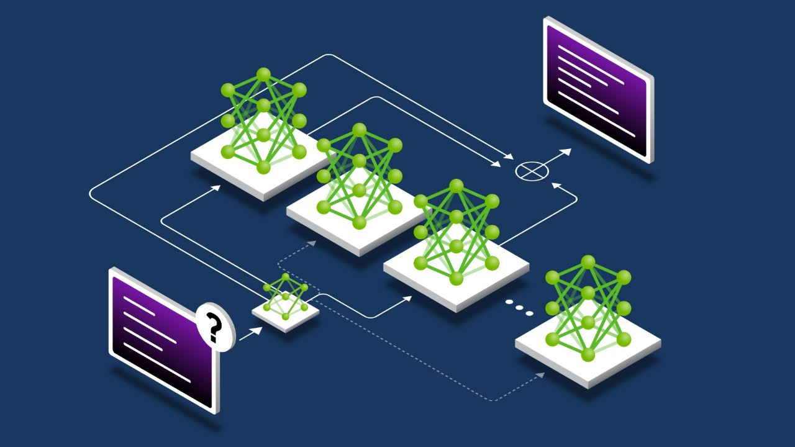
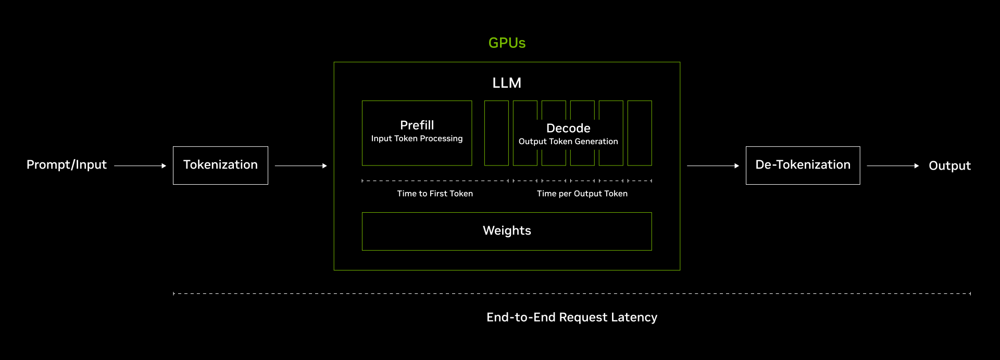
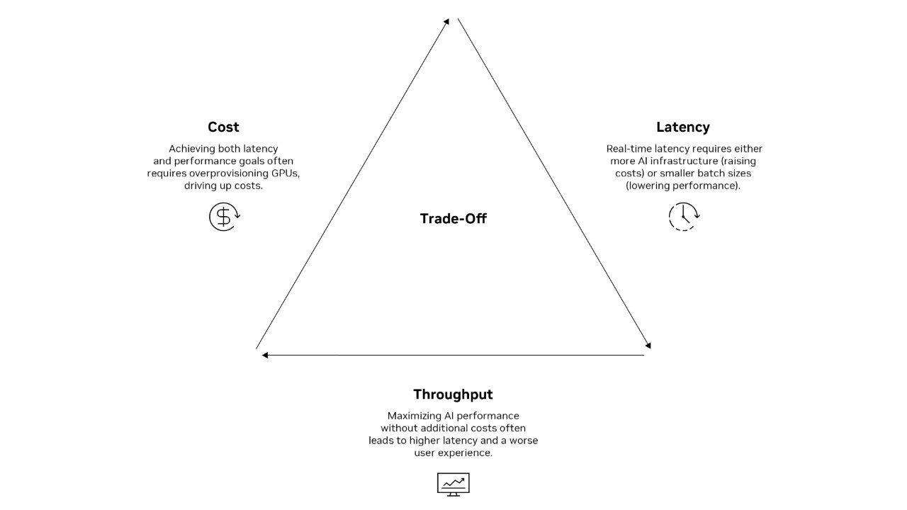

# [What is AI Inference?](https://www.nvidia.com/en-us/glossary/ai-inference/)

# What Is AI Inference?

Inference is the process where a trained AI model generates new outputs by reasoning and making predictions on new data—classifying inputs and applying learned knowledge in real time.

## What Are the Benefits of AI Inference?

AI inference helps solve advanced application deployment challenges by bringing [machine learning](https://www.nvidia.com/en-us/glossary/machine-learning/) and [artificial intelligence](https://www.nvidia.com/en-us/glossary/artificial-intelligence/) technology to the real world. From voice-activated [AI assistants](https://www.nvidia.com/en-us/use-cases/ai-assistants/) and personalized shopping recommendations to robust fraud detection systems, inference is powering AI workloads everywhere.

- **New Products, Workflows, and AI Solutions:** Inference powers test-time compute and AI reasoning. Models such as [DeepSeek-R1](https://blogs.nvidia.com/blog/deepseek-r1-nim-microservice/), [Google DeepMind’s](https://blogs.nvidia.com/blog/gemma-nim-google-deepmind/) Gemini 2.0 Flash Thinking, and [NVIDIA Llama Nemotron™](https://nvidianews.nvidia.com/news/nvidia-launches-family-of-open-reasoning-ai-models-for-developers-and-enterprises-to-build-agentic-ai-platforms) models are a new class of AI reasoning, or “long-thinking” models. Reasoning models perform multiple passes to work and reason through complex problems to deliver higher accuracy and explainability. This is only possible with low-latency, high-performance inference.
- **Enhanced User Experience:** High-performance AI inference enhances end-user experiences by providing fast, accurate responses for real-time interactions. High-quality user experiences are guaranteed while also balancing the cost per token and overall system latency.
- **Safety and Reliability:** In safety-critical applications such as robotics and autonomous vehicles, accurate, real-time inference is essential. Low-latency inference enables these systems to perceive, interpret, and respond to their environment instantly, reducing response times to increase precision and safety.
- **Automating Workflows:** AI inference automates repetitive tasks, boosting productivity, reducing errors, and freeing human resources for more complex tasks.

### Featured Resource

[Mixture of Experts Powers the Most Intelligent Frontier AI Models, Runs 10x Faster on NVIDIA Blackwell NVL72](https://blogs.nvidia.com/blog/mixture-of-experts-frontier-models/)

Quick Links

[AWS, Google, Microsoft and OCI Boost AI Inference Performance for Cloud Customers With NVIDIA Dynamo](https://blogs.nvidia.com/blog/think-smart-dynamo-ai-inference-data-center)

[Optimize AI Inference Performance with NVIDIA Full-Stack Solutions](https://developer.nvidia.com/blog/optimize-ai-inference-performance-with-nvidia-full-stack-solutions/)

## Key Differences Between AI Training Versus Inference

AI training is the process where an AI model or neural network learns to perform a specific task by adjusting its weights based on a set of training data. This process involves multiple iterations to achieve high accuracy, especially when working with large datasets and changing parameters.

Inference is the application of the trained model to real-world data, generating new outputs through predictions or classifications. This phase is optimized for speed and efficiency, often using techniques like speculative decoding, quantization, pruning, and layer fusion to enhance performance while maintaining accuracy.

As models grow in complexity, especially with advanced AI reasoning models, they require more compute resources for inference. Enterprises must scale their accelerated computing resources to support the next generation of AI tools, enabling complex problem-solving, coding, and multistep planning.

[Learn more: How Scaling Laws Drive Smarter, More Powerful AI](https://blogs.nvidia.com/blog/ai-scaling-laws/)

## How Does AI Inference Work?

AI inference, particularly in the context [large language models](https://www.nvidia.com/en-us/glossary/large-language-models/) (LLMs), works by generating [AI tokens](https://blogs.nvidia.com/blog/ai-tokens-explained/) and determines the speed, cost, and user experience associated with these tokens. Specialized hardware such as high-performance GPUs and networking are used to provide the compute and efficiency needed for this large workload, which is further optimized with full-stack software enabled by accelerated computing.

Figure description: The diagram illustrates the flow of model inference in LLMs, starting with tokenization of the user’s prompt and progressing through two GPU phases: Prefill (input token processing) and Decode (output token generation). The end-to-end request latency includes the time for tokenization, prefill, decoding, and de-tokenization into human-readable output.

### **Model Inference**

  
- **Input Processing:** When a user provides input data (e.g., a text query), the AI model processes this input and breaks it down into tokens. Tokens are the smallest units of text that the model can understand and work with. For example, a sentence might be broken down into words, subwords, or even characters, depending on the tokenization strategy.
- **Token Generation:** The model then uses the tokens from the input to generate a response. The model processes these embeddings through its layers to generate a contextually appropriate response. GPUs are typically used for this step due to their parallel processing capabilities, which can significantly speed up the computation for complex models.
- **Output Decoding:** The generated tokens are assembled into a coherent response, which is then returned to the user.

### **AI Token Cost**

**Cost per Token:** The cost of AI inference is often measured in terms of the cost per token. This is because the computational resources required to process and generate tokens can be significant, especially for [multimodal large language models (MLLMs)](https://www.nvidia.com/en-us/glossary/multimodal-large-language-models/) and [frontier mixture-of-experts models](https://blogs.nvidia.com/blog/mixture-of-experts-frontier-models/).

- **Latency:** Latency is the time it takes to generate each token in AI inference. Low latency is crucial for real-time AI applications, as it enhances user experience. However, achieving low latency often increases costs due to the need for more powerful hardware and real-time processing, which can also increase computational load.
- **Throughput:** The number of tokens that can be processed per unit of time also affects cost. Higher throughput can be achieved by optimizing the model and using techniques like dynamic batching.

## How Is AI Inference Deployed?

|  |  |
| --- | --- |
| **Inference Deployment Type** | **Description** |
| **Batch Inference** | Combines multiple user requests to maximize GPU usage, providing high throughput for many users. |
| **Real-Time Inference** | Processes data instantly as it arrives, essential for applications needing immediate decisions, like autonomous driving or video analysis. |
| **Distributed** | Runs AI inference across multiple devices or nodes simultaneously to parallelize computations, enabling efficient scaling for large models and lower latency. |
| **Disaggregated** | Divides the AI thinking process into two distinct stages—initial analysis and response generation—and runs each stage on specialized computers to enhance efficiency. |

## LLM Inference for Generative AI Use Cases

Large language model (LLM) inference is a critical component in [generative AI](https://www.nvidia.com/en-us/glossary/generative-ai/) applications, chatbots, and document summarization. These applications require a balance of high performance, low latency, and efficient resource utilization to deliver a seamless user experience and maintain cost-effectiveness.

Three primary metrics for evaluating LLM inference include Time to First Token, Time to Output Token, and Goodput.

### **Time to First Token (TTFT): User Experience**

Measures the time it takes for the system to generate the first token, crucial for maintaining user engagement. A shorter TTFT ensures that users receive an initial response quickly, which is essential for keeping them engaged and satisfied.

### **Time Per Output Token (TPOT): Throughput**

Measures the average time taken to generate each subsequent token, impacting the overall speed and efficiency of the inference process. Reducing TPOT is vital for ensuring that the entire response is generated quickly, which is particularly important for real-time applications like chatbots and live translations.

### **Goodput: System Efficiency**

Balances latency, performance, and cost by measuring throughput while maintaining target TTFT and TPOT, optimizing AI inference for business goals.

## What Are the Challenges of AI Inference?

The key challenges in AI inference involve [balancing latency, cost, and throughput](https://www.nvidia.com/en-us/solutions/ai/inference/balancing-cost-latency-and-performance-ebook/). High performance often requires overprovisioning GPUs, which increases costs. Real-time latency demands either more AI infrastructure or smaller batch sizes, which can lower performance. Achieving both low latency and high throughput without additional costs is difficult, often leading to data center trade-offs.

Figure description: The core challenge of AI inference is balancing latency, cost, and throughput. By favoring one, you may need to trade off maximum value in another.

The following optimization techniques can be used to help overcome these challenges:

|  |  |
| --- | --- |
| **Title (Techniques?)** | **Title (Challenges?)** |
| **Advanced Batching** | Techniques like dynamic, sequence, and inflight batching optimize GPU usage, balancing throughput and latency. |
| **Chunked Prefill** | Breaks input into smaller chunks to reduce processing time and cost. |
| **Multiblock Attention** | Optimizes the attention mechanism to focus on relevant input parts, reducing computational load and cost. |
| **Model Ensembles** | Uses multiple algorithms to improve prediction accuracy and robustness. |
| **Dynamic Scaling** | Adjusts GPU resources in real time to optimize costs and maintain high performance during peak loads. |

By implementing these advanced techniques and best practices, businesses can ensure that their AI applications deliver high performance, low latency, and cost efficiency, ultimately driving better user experiences and business outcomes.

### **How Does Inference Enable AI Reasoning?**

AI inference enables reasoning models with a [new scaling law](https://blogs.nvidia.com/blog/ai-scaling-laws/) known as test-time scaling, which allows them to perform a sequence of inference passes. This process involves the model iteratively “thinking” through the problem, creating more output tokens and longer generation cycles, which helps in generating higher-quality responses. Significant test-time compute is essential to support real-time inference and enhance the quality of responses from reasoning models.

### **How Does AI Inference Work in an AI Factory?**

An [AI factory](https://www.nvidia.com/en-us/glossary/ai-factory/) is a large-scale computing infrastructure designed to automate the development, deployment, and continuous improvement of AI models. AI inference plays a crucial role in these systems, as it represents the final stage where trained models generate real-world predictions and decisions. Once a model is developed within an AI factory, it is optimized and deployed for inference, to deliver high-performance, low-latency AI services across cloud, hybrid, or on-prem environments.

The AI factory also ensures inference remains efficient through constant optimization and management of accelerated AI infrastructure. Additionally, by setting up an AI [data flywheel](https://developer.nvidia.com/blog/maximize-ai-agent-performance-with-data-flywheels-using-nvidia-nemo-microservices/), the inference results feed back into the AI factory, allowing continuous learning and refinement of models based on real-world data. This feedback loop helps AI systems evolve, improving accuracy and efficiency over time. By tightly integrating AI inference into its workflow, an AI factory enables scalable, cost-effective AI deployments across industries.

### **Getting Started With AI Inference**

NVIDIA provides full-stack libraries, software, and services to help you get started with AI inference. With the largest inference ecosystem, purpose-built acceleration software, advanced networking, and industry-leading performance per watt, NVIDIA is delivering the high throughput, low latency, and cost efficiency needed for this new era of AI computing.

## Next Steps

##### Learn About NVIDIA Inference

Learn about the [NVIDIA Inference Platform](https://www.nvidia.com/en-us/solutions/ai/inference/), including [NVIDIA Dynamo](https://www.nvidia.com/en-us/ai/dynamo/) for a full-stack approach to AI.

[Learn More](https://www.nvidia.com/en-us/solutions/ai/inference/)

##### Discover How to Optimize Inference

Read about how to [optimize AI inference](https://developer.nvidia.com/blog/optimize-ai-inference-performance-with-nvidia-full-stack-solutions/) for high throughput and low latency with NVIDIA full-stack solutions.

[Learn More](https://developer.nvidia.com/blog/optimize-ai-inference-performance-with-nvidia-full-stack-solutions/)

##### Performance Benchmarks

Reference [inference performance benchmarks](https://developer.nvidia.com/deep-learning-performance-training-inference/ai-inference) to see how your favorite models will perform.

[Learn More](https://developer.nvidia.com/deep-learning-performance-training-inference/ai-inference)
