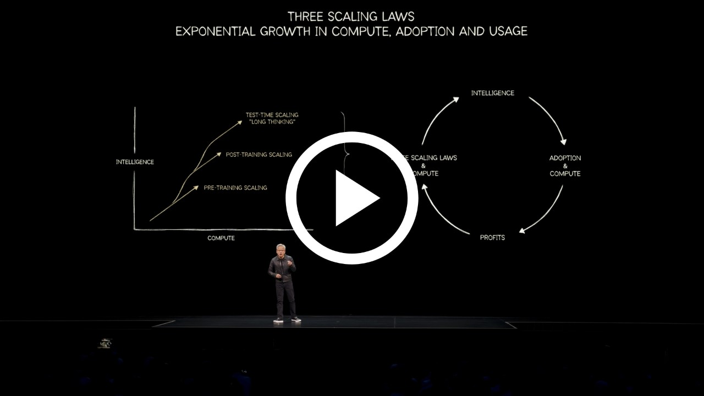
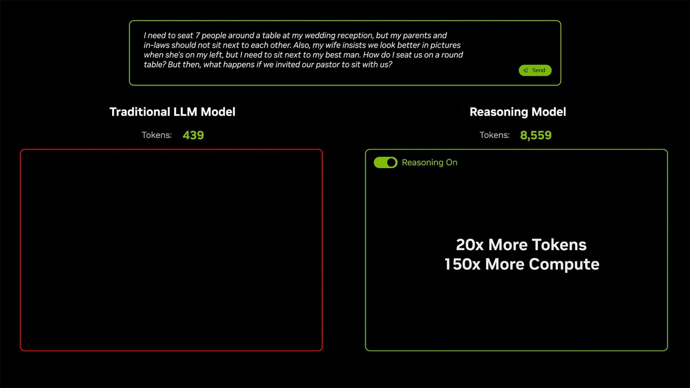

# [What Is AI Reasoning and Why Is It Important for Generative AI?](https://www.nvidia.com/en-us/glossary/ai-reasoning/)

# What Is AI Reasoning?

AI reasoning is how AI systems analyze and solve problems by evaluating various outcomes and selecting the best solution, similar to human decision-making.

- [Overview](#overview)
- [How It Works](#how)
- [Core Components](#cc)
- [Advanced Techniques](#adv)
- [Benefits](#ben)
- [Use Cases](#uc)
- [Next Steps](#ns)

- [Overview](#overview)
- [How It Works](#how)
- [Core Components](#cc)
- [Advanced Techniques](#adv)
- [Benefits](#ben)
- [Use Cases](#uc)
- [Next Steps](#ns)

- [Overview](#overview)
- [How It Works](#how)
- [Core Components](#cc)
- [Advanced Techniques](#adv)
- [Benefits](#ben)
- [Use Cases](#uc)
- [Next Steps](#ns)

## Why Is AI Reasoning Important for Generative AI?

AI reasoning is crucial for [generative AI](https://www.nvidia.com/en-us/glossary/generative-ai/) because it bridges the gap between pattern recognition and sophisticated decision-making. Traditional generative models like GPT-4 and DALL-E excel at creating content based on statistical probabilities and can churn out answers with low latency. Reasoning frameworks enable frontier [mixture-of-experts models](https://blogs.nvidia.com/blog/mixture-of-experts-frontier-models/) and enhance traditional large language model (LLM)-based AI systems, enabling them to handle dynamic environments, predict outcomes, and optimize processes. Because reasoning models “think before speaking,” they often take longer to return a response but offer a high degree of accuracy and more nuanced solutions to complex problems.

This integration not only enhances the capabilities of AI but also paves the way for advancements in human-machine collaboration, where AI can provide more actionable insights across various industries.

### NVIDIA CEO Jensen Huang Highlights Three Scaling Laws for AI

Learn how pretraining, post-training, and test-time scaling are building blocks for AI reasoning, and how NVIDIA’s extreme software-hardware codesign with NVIDIA GB200 and GB300 NVL72 delivers 10x higher perf-per-dollar, perf-per-watt, and revenue.

[Watch Keynote Chapter](https://www.youtube.com/watch?v=lQHK61IDFH4&t=2533s)

Quick Links

[NVIDIA Launches Open Models and Data to Accelerate AI Innovation Across Language, Biology, and Robotics](https://blogs.nvidia.com/blog/open-models-data-ai/)

[How Do You Teach an AI Model to Reason? With Humans](https://blogs.nvidia.com/blog/ai-reasoning-cosmos/)

# How Does AI Reasoning Work?

AI reasoning combines advanced techniques that enhance the logical consistency and decision-making capabilities of generative models. By integrating methods such as [chain-of-thought prompting](https://www.nvidia.com/en-us/glossary/cot-prompting/), test-time scaling, and reinforcement learning, AI systems can tackle complex problems more effectively and reliably.

Achieving this level of intelligence requires massive computational power. Unlike traditional AI models that rapidly generate a one-shot answer to a user prompt, reasoning models use extra computational resources during inference to break down tasks into smaller steps and think through multiple potential responses before arriving at the best answer.

On more complex tasks, like generating customized code for developers, AI reasoning models can take multiple minutes or even hours to return the best response.

## Core Components of AI Reasoning

|  |  |
| --- | --- |
| **Component** | **Role** |
| **Knowledge Representation** | AI systems store structured information in formats like knowledge graphs, ontologies, and semantic networks. These frameworks map real-world entities and relationships, providing the foundation for complex reasoning by enabling context understanding and logical inference. |
| **Inference Engine** | The inference engine processes data from the knowledge base using logical rules to derive new insights or make decisions. It mirrors human reasoning by classifying inputs, applying learned knowledge, and generating predictions in real time. |
| **Machine Learning Algorithms** | [Machine learning](https://www.nvidia.com/en-us/glossary/machine-learning/) enhances reasoning by identifying patterns in data, adapting to new information, and refining decision-making over time. Techniques like supervised learning, unsupervised learning, and reinforcement learning allow for exploration, planning, and aligning with human values. |
| **AI Reasoning Tokens** | [AI tokens](https://blogs.nvidia.com/blog/ai-tokens-explained/) help boost inference-serving by managing the computational demands of reasoning tasks. The reasoning process can take multiple minutes or even hours, and challenging queries can require over 100 times more compute compared to a single inference pass on a traditional LLM. These tokens optimize the use of computational resources, ensuring efficient and effective AI reasoning workloads. |

**Chain-of-Thought Prompting**

- Chain-of-thought (CoT) prompting exemplifies the evolution of AI reasoning. By breaking down queries into sequential reasoning steps, CoT prompting helps AI systems identify key components, analyze relationships, and synthesize conclusions. This method enhances the logical consistency and reliability of generative AI outputs.

**Test-Time Scaling**

- [Test-time scaling](https://blogs.nvidia.com/blog/ai-scaling-laws/), one of the AI scaling laws, involves applying more computational resources during the inference phase to improve the accuracy of AI models. This approach enables [large language models](https://www.nvidia.com/en-us/glossary/large-language-models/) to perform multiple inference passes, working through complex problems step-by-step. Test-time scaling, also known as long thinking, requires intensive computational resources, driving further demand for accelerated computing.

**Reinforcement Learning for Reasoning**

- [Reinforcement learning](https://www.nvidia.com/en-us/glossary/reinforcement-learning/) (RL) enhances AI reasoning by enabling systems to learn through trial-and-error interactions and adapt strategies based on feedback. RL agents evaluate multiple outcomes in various environments, such as games and robotics, by balancing the exploration of new strategies with the exploitation of known effective actions. [DeepSeek-R1](https://blogs.nvidia.com/blog/deepseek-r1-nim-microservice/) employs a multi-stage hybrid approach where reinforcement learning enhances reasoning capabilities while supervised fine-tuning (SFT) ensures human-readable outputs.

## Advanced Techniques in AI Reasoning

### Chain-Of-Thought Prompting

Chain-of-thought (CoT) prompting exemplifies the evolution of AI reasoning. By breaking down queries into sequential reasoning steps, CoT prompting helps AI systems identify key components, analyze relationships, and synthesize conclusions. This method enhances the logical consistency and reliability of generative AI outputs.

### Test-Time Scaling

[Test-time scaling](https://blogs.nvidia.com/blog/ai-scaling-laws/), one of the AI scaling laws, involves applying more computational resources during the inference phase to improve the accuracy of AI models. This approach enables [large language models](https://www.nvidia.com/en-us/glossary/large-language-models/) to perform multiple inference passes, working through complex problems step-by-step. Test-time scaling, also known as long thinking, requires intensive computational resources, driving further demand for accelerated computing.

### Reinforcement Learning for Reasoning

[Reinforcement learning](https://www.nvidia.com/en-us/glossary/reinforcement-learning/) (RL) enhances AI reasoning by enabling systems to learn through trial-and-error interactions and adapt strategies based on feedback. RL agents evaluate multiple outcomes in various environments, such as games and robotics, by balancing the exploration of new strategies with the exploitation of known effective actions. [DeepSeek-R1](https://blogs.nvidia.com/blog/deepseek-r1-nim-microservice/) employs a multi-stage hybrid approach where reinforcement learning enhances reasoning capabilities, while supervised fine-tuning (SFT) ensures human-readable outputs.

## What Are the Benefits of AI Reasoning?

### Enhances Critical Thinking for Complex Problems

AI reasoning enables [multi-agent systems](https://www.nvidia.com/en-us/glossary/multi-agent-systems/) to decompose complex requests into multiple manageable steps, improving problem-solving accuracy and efficiency.

### Improves Decision-Making

By predicting and evaluating multiple scenarios simultaneously, AI reasoning helps organizations make more informed and strategic decisions.

### Reduces Risk

AI reasoning reduces risk by enabling systems to analyze vast datasets, identify patterns, and predict potential outcomes with greater accuracy and speed than traditional methods.

### Supports Multistep Planning

AI reasoning excels at handling intricate tasks that require logical consistency, such as coding, scheduling, and long-term planning.

### Boosts Efficiency and Productivity

AI reasoning automates workflows, reduces human error, optimizes resource allocation, and accelerates decision-making processes, enabling employees to focus on high-value tasks and improve overall output.

## Industry Use Cases

AI reasoning has transformative potential across industries.

Cosmos Reason VLM use cases

**In healthcare**, it can analyze vast datasets to predict disease progression, evaluate treatment risks, and optimize drug development processes.

**In retail**, reasoning can improve supply chain logistics by forecasting demand, optimizing inventory levels, and planning efficient delivery routes. Reasoning-based chatbots and recommendation engines in ecommerce can provide personalized shopping experiences, answer customer queries accurately, and suggest products based on user preferences.

**In finance**, banks can leverage AI reasoning for fraud detection, market risk assessments, and investment scenario simulations.

**In manufacturing**, AI reasoning can enhance productivity through predictive maintenance of machinery, streamlined production schedules, and optimized resource utilization to reduce downtime and costs.

**In robotics**, AI reasoning enables machines to break down complex tasks into manageable steps, adapt to novel situations, and optimize actions through embodied chain-of-thought reasoning (ECoT), probabilistic modeling, and reinforcement learning. With real-time analysis of sensor data, robots can perform intricate operations in medical settings, factories, warehouses, and more.

## AI Models That Reason

[AI reasoning models](https://build.nvidia.com/explore/reasoning) are quickly gaining popularity among enterprise and individual users alike for their ability to emulate human-like logical processes. Leading models include:

- **NVIDIA Cosmos Reason:** Open, customizable, 7-billion-parameter [reasoning VLM for physical AI and robotics](https://build.nvidia.com/nvidia/cosmos-reason1-7b) — lets robots and vision AI agents reason like humans, using prior knowledge, physics understanding and common sense to understand and act in the real world.
- **NVIDIA Llama Nemotron Models**: Built on Meta’s Llama models, the [Llama Nemotron family of models](https://www.nvidia.com/en-us/ai-data-science/foundation-models/llama-nemotron/) includes Nano, Super, and Ultra variants, tailored for edge devices and data centers. It features toggled reasoning capabilities and excels in multistep tasks like tool utilization, math, and instruction adherence.
- **DeepSeek-R1**: Known for its affordability and robust performance, DeepSeek-R1 excels in mathematical reasoning, coding, and scientific problem-solving. It employs reinforcement learning and multi-stage training, allowing users to observe its step-by-step thought process for greater trust and explainability.
- **OpenAI o1 and o3-mini**: These models, available on ChatGPT, focus on simulated reasoning, enabling them to pause and reflect on their internal thought processes before responding. OpenAI o3-mini improves upon o1 by offering faster responses, reduced costs, and enhanced accuracy in STEM domains.

Quick Links

[Train a Reasoning-Capable LLM in One Weekend With NVIDIA NeMo™](https://developer.nvidia.com/blog/train-a-reasoning-capable-llm-in-one-weekend-with-nvidia-nemo/)

[Build an AI Agent With Expert Reasoning Capabilities Using the DeepSeek-R1 NIM](https://developer.nvidia.com/blog/build-ai-agents-with-expert-reasoning-capabilities-using-deepseek-r1-nim/)

## Getting Started With AI Reasoning

[NVIDIA Llama Nemotron](https://nvidianews.nvidia.com/news/nvidia-launches-family-of-open-reasoning-ai-models-for-developers-and-enterprises-to-build-agentic-ai-platforms) supports AI reasoning by offering post-training enhancements that improve multistep math, coding, and decision-making capabilities, boosting accuracy by up to 20% and optimizing inference speed by 5x compared to other reasoning models.

To help developers take advantage of DeepSeek’s reasoning, math, coding, and language understanding, the 671-billion-parameter [DeepSeek-R1 model is now available as an NVIDIA NIM](https://blogs.nvidia.com/blog/deepseek-r1-nim-microservice/)™ microservice on [build.nvidia.com](http://build.nvidia.com/).

[OpenAI Triton on NVIDIA Blackwell](https://developer.nvidia.com/blog/openai-triton-on-nvidia-blackwell-boosts-ai-performance-and-programmability/) supports AI reasoning by leveraging advanced Tensor Core optimizations and precision formats to enhance matrix multiplication and attention mechanisms, which are critical for reasoning tasks. This combination boosts computational efficiency and accuracy, enabling faster inference and more reliable outputs.

[Cosmos Reason](https://build.nvidia.com/nvidia/cosmos-reason1-7b) can now be downloaded from [Hugging Face](https://huggingface.co/collections/nvidia/cosmos-reason1-67c9e926206426008f1da1b7). Access [inference](https://github.com/nvidia-cosmos/cosmos-reason1?tab=readme-ov-file#inference) and [post-training scripts](https://github.com/nvidia-cosmos/cosmos-reason1/blob/main/examples/post_training/README.md) on GitHub to customize with your data.

## Next Steps

### Ready to Get Started With AI Reasoning?

Deploy frontier AI reasoning models optimized for performance and ROI on NVIDIA’s full-stack inference platform.

[Explore Models](https://developer.nvidia.com/ai-models)

[Start Building](https://build.nvidia.com/models)

### Scale AI With Validated Architectures

Use NVIDIA Enterprise Reference Architectures to build scalable, high-performance, and secure AI factories that accelerate AI workloads with optimal efficiency.

[Get Started](https://www.nvidia.com/en-us/technologies/enterprise-reference-architecture/)

## Get the Latest on AI Reasoning at NVIDIA

Sign up for the latest AI reasoning news, ecosystem announcements, and more from NVIDIA.

[Stay Informed](https://www.nvidia.com/en-us/solutions/ai/inference/#sign-up-form)

## What Are the Benefits of AI Reasoning?

Across any domain, reasoning can power [AI agents](https://www.nvidia.com/en-us/glossary/ai-agents/) that boost efficiency and productivity by providing users with highly capable assistants to accelerate their daily work.

|  |  |
| --- | --- |
| **Benefit** | **Description** |
| **Enhances Critical Thinking for Complex Problems** | AI reasoning enables [multi-agent systems](https://www.nvidia.com/en-us/glossary/multi-agent-systems/) to decompose complex requests into multiple manageable steps, improving problem-solving accuracy and efficiency. |
| **Improves Decision-Making** | By predicting and evaluating multiple scenarios simultaneously, AI reasoning helps organizations make more informed and strategic decisions. |
| **Reduces Risk** | AI reasoning reduces risk by enabling systems to analyze vast datasets, identify patterns, and predict potential outcomes with greater accuracy and speed than traditional methods. |
| **Supports Multistep Planning** | AI reasoning excels at handling intricate tasks that require logical consistency, such as coding, scheduling, and long-term planning. |
| **Boosts Efficiency and Productivity** | AI reasoning automates workflows, reduces human error, optimizes resource allocation, and accelerates decision-making processes, enabling employees to focus on high-value tasks and improve overall output. |
