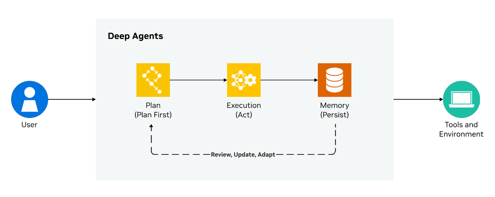
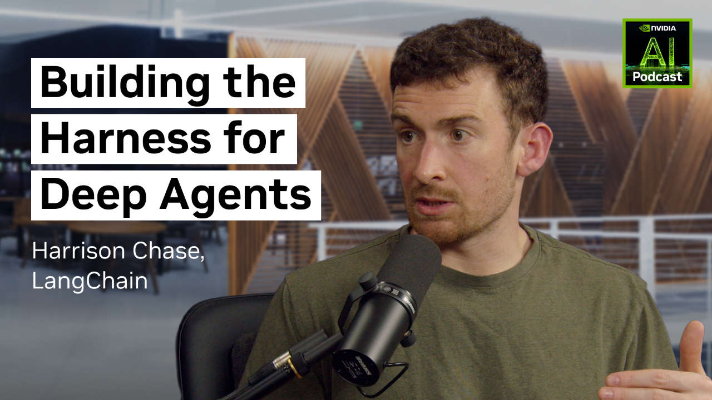

# [What Is a Deep Agent?](https://www.nvidia.com/en-us/glossary/deep-agents/)

# What Are Deep Agents?

Deep agents are AI agents designed for complex, long-running work. They combine explicit planning, persistent memory, tool execution, reusable skills, and subagent delegation to decompose tasks, track progress, and act autonomously over time.

- [How It Works](#how-it-works)
- [Role of Subagents](#role)
- [Deep vs. Shallow Agents](#deep)
- [Use Cases](#use-cases)
- [Benefits](#benifits)
- [Challenges and Solutions](#challenges)
- [Next Steps](#ns)

- [How It Works](#how-it-works)
- [Role of Subagents](#role)
- [Deep vs. Shallow Agents](#deep)
- [Use Cases](#use-cases)
- [Benefits](#benifits)
- [Challenges and Solutions](#challenges)
- [Next Steps](#ns)

- [How It Works](#how-it-works)
- [Role of Subagents](#role)
- [Deep vs. Shallow Agents](#deep)
- [Use Cases](#use-cases)
- [Benefits](#benifits)
- [Challenges and Solutions](#challenges)
- [Next Steps](#ns)

## How Do Deep Agents Work?

A deep agent works by combining planning, execution, and memory so it can run complex workflows over long periods of time instead of looping through tool calls.

For maximum resource efficiency, it relies on four architectural pillars: explicit planning, hierarchical delegation, persistent memory, and specialized system prompts.

1. **Explicit planning** helps the deep agent maintain a plan, task list, or working state that it reviews and updates between executed steps. It tracks status, marks tasks as complete or blocked, and adjusts strategy when steps fail rather than blindly retrying.
2. **Hierarchical delegation** is employed next via subagents. An orchestrator breaks complex requests into specialized tasks. An isolated subagent handles each task with clean context, returning only synthesized results.
3. **Persistent memory** is used through file system access. Deep agents shift from “remembering everything in context” to “knowing where to find information” via external storage.
4. **Specialized system** prompts are then accessed with agent skills. These instructions define decision thresholds, tool-usage patterns, and subagent spawning protocols.

Because deep agents can autonomously execute code, access file systems, and spawn subprocesses, production deployments require sandboxed execution environments with OS-level isolation. Application-level controls alone are insufficient as once an agent passes control to a subprocess, only OS-level enforcement can ensure containment. Together, these components and considerations decouple planning from execution and externalize memory beyond the context window, enabling agents to operate reliably across hundreds of steps and extended time horizons.

A deep agent separates planning, execution and memory so it can run complex workflows over long periods of time instead of looping through calls

## What Is the Role of a Subagent?

Within a deep agent, a subagent is a specialized, isolated worker that executes a delegated subtask—such as searching, coding, or analysis—using its own context so the orchestrator can combine results into a coherent final output. This context isolation prevents interference between subtasks and enables parallel, focused execution.

### How Do “Deep” Agents Differ From “Shallow” Agents?

Unlike “shallow” agents, which are limited to clearly defined use cases like report generation or retrieval-augmented generation (RAG), deep agents represent the next iteration for AI agents that enable generalized, long-running tasks.

Shallow agents operate through a simple reactive loop: Receive a prompt, call the model, parse a tool call, execute it, observe the result, and repeat. Their entire state exists within the model’s context window, making them stateless and ephemeral. They excel at tasks requiring fewer steps but fail at tasks requiring hundreds—context overflows with accumulated tool outputs, high-level goals degrade amid procedural noise, and there is little recovery mechanism when the agent goes down a rabbit hole.

Deep agents solve these limitations by externalizing planning into persistent documents, delegating work to specialized subagents with isolated context and using file systems as shared workspaces for long-term memory. Where a shallow agent implicitly reasons step-by-step inside its context window, a deep agent explicitly plans, tracks progress, and adapts like a project manager coordinating specialists rather than a single worker executing instructions sequentially.

Agents continue to grow more advanced due to emerging techniques. The difference lies within their architecture—how they’re designed, what tools are used, and which capabilities they have when operating. Learn more about [different types of agents](https://www.nvidia.com/en-us/glossary/ai-agents/#:~:text=What%20Are%20the%20Types%20of%20AI%20Agents%3F).

#### LangChain Deep Agents Podcast

Hear from Harrison Chase, CEO of LangChain on how deep agents work and why enterprises need a strategy to secure them.

[Watch the Interview](https://www.youtube.com/watch?v=c-fsL0gsmo0)

## Applications and Use Cases of Deep Agents

Deep agents thrive where tasks are too complex, long-running, or multifaceted for automation by simple ReAct agents. These include areas requiring planning, delegation, and persistent context.

##### Software Development

Coding agents like Claude Code, Codex, Cursor, and GitHub Copilot leverage deep agent patterns—planning tools, subagents, and file system access—to navigate large codebases, generate code, write tests, debug issues, and execute multi-file refactors. These agents don’t just autocomplete; they decompose engineering tasks into subtasks, track progress, and adapt when builds fail.

[Watch Scaling Code Review Agents With CodeRabbit](https://www.youtube.com/watch?v=Fo9jgL_x7hU)

##### Deep Research

All major model providers now offer deep research agents that autonomously browse dozens of sources, synthesize findings, and produce structured reports, work that would otherwise take a human hours to complete now condensed into minutes. This extends to market analysis, competitive intelligence, and compliance review.

[Read How to Create Deep Agents With LangChain and NVIDIA AI-Q](https://developer.nvidia.com/blog/how-to-build-deep-agents-for-enterprise-search-with-nvidia-ai-q-and-langchain/)

##### Computer Use Agents

Computer use agents help automate everyday desktop tasks—like filling out forms or navigating apps—by teaching the agent to “see” the screen, plan clicks and keystrokes, and adapt on the fly, all without needing deep API integration. This turns repetitive GUI work into a simple, teachable workflow.

[Read How to Create a Bash Computer Agent](https://developer.nvidia.com/blog/create-your-own-bash-computer-use-agent-with-nvidia-nemotron-in-one-hour/)

## What Are the Benefits of Deep Agents?

### Handles Complex, Long-Horizon Tasks

Leverages specialized, modular skills and executes workflows spanning long time horizons, unlike shallow agents.

### Scalable Context Management

File system access and subagent delegation prevent context overflow by externalizing information beyond the context window.

### Safer, Autonomous Execution via Sandboxing

OS-level isolation enables agents to safely execute code and spawn subprocesses in production.

### Resilient Planning and Error Recovery

Adapts strategy when steps fail instead of entering infinite loops or losing the goal.

## Challenges and Solutions

Deep agents introduce powerful new capabilities, but they also bring unique challenges that demand careful design, safeguards, and evaluation to operate safely and reliably in production.

## Safeguarding and Oversight Mechanisms for Production Agents

Agents in production should follow the principle of least privilege, only allowing the minimum access necessary to do their job and nothing more.

### **This includes but is not limited to:**

- Role-based access controls (RBAC) on tools, APIs, and databases.
- Strict network policies such as deny-by-default policies and allowlists.
- Additionally, human-in-the-loop capabilities to review and approve agent actions before they execute and real-time monitoring and observability of agent actions are crucial considerations for agents in production.

[Watch Livestream on How to Authenticate Agent Skills](https://www.youtube.com/watch?v=sVpKonYJ4D4)

## Evaluating Agentic Systems for Real-World Usage

Agentic systems operate in open-ended, dynamic environments with tools, memory, policies, latency constraints—failure modes that static benchmarks don’t fully capture. So, evaluations have to move beyond model-centric scoring toward full-stack system validation that’s aimed at making sure agents solve tasks reliably in production, not just in isolated occurrences.

### **To test agent performance in real-world use scenarios:**

- Use a combination of scenario-based testing, tool-use validation, and multi-step success metrics to evaluate the agent’s full trajectory.
- Assess continuous behavior from simulation to live deployment.
- Make updates as data, tools, and user behavior evolves over time.

[Read Evaluation Tips](https://developer.nvidia.com/blog/mastering-agentic-techniques-ai-agent-evaluation/)

Quick Links

[Tutorial: How to Build Deep Agents for Enterprise Search With NVIDIA AI-Q and LangChain](https://developer.nvidia.com/blog/how-to-build-deep-agents-for-enterprise-search-with-nvidia-ai-q-and-langchain/)

[Workshop: How to Build a Deep Agent](https://developer.nvidia.com/topics/ai/how-to-build-deep-ai-agents)

## FAQs

## How do you create bespoke test logic for each datapoint when evaluating deep agents?

For deep agents to succeed, their evaluations need to be task aware. There are many datapoints that represent different tools, constraints, and definitions of success, so we have to customize the checks that define what we care about for each task. In some cases, we might put more emphasis on output verification. In others, what tools the agent calls, the sequence it follows, and the policies it optimizes for might be what you emphasize.

In practice, the best way to create these tests is to start from first principles and think through what you care about, how you can quantify it, and what concrete labels or signals are returned by the environment to help with the quantification. Once you come up with measurements, create small example tests and gradually iterate.

## What are the best practices for single-step vs. full-turn vs. multi-turn evaluations?

Observability is key when evaluating agent behavior. Single-step evaluations help diagnose which step in the agent’s reasoning process failed, full-turn evaluations help determine what user queries the agent has trouble addressing, and multi-turn evaluation can determine where across a full conversation the agent broke. Across all three levels of evaluation, there are certain principles that apply:

- **Practice eval-driven development:** Define evals for planned capabilities before building them, not after.
- **Build datasets from real failures:** Synthetic coverage is useful, but production failures can catch what you didn’t anticipate.
- **Start with tracing, not scoring:** Manually review agent traces first—what you observe informs which metrics actually matter.

## What are the best practices for self-developed agents in production?

As you migrate agents into production, consider starting from the minimal viable setup an agent requires to succeed in your environment. Agents can be connected to a lot of capabilities and tools, but starting with the most basic setup enables you to test your agent observability, discern what capabilities are actually essential for success on your tasks, and balance potentially compute-expensive tradeoffs.

Due to the nature of production environments and the importance of reliability and other key factors, it is further recommended that, where appropriate, you analyze what verified and vetted components are offered by the ecosystem rather than defaulting to building bespoke features or tools.

## How do you implement the router pattern for routing to multiple specialized deep agents?

When you are routing to multiple specialized deep agents, you should use a top-level orchestrator to classify the incoming task, select the best specialist agent, and forward the request along with any needed tools, policies, and context. By working to measure intent and capability, this layer matches multiple expert agents as needed to fulfill the user’s task or query.

The routing decision itself can be based on different factors such as intent, domain, required tools, complexity, latency targets, or policy constraints. This works as long as each agent is described by a clear capability profile, including what tasks it handles well and what tells it has access to. If the orchestrator’s confidence is low, the system can fall back to a more general agent or ask for clarification.

Quick Links

[Read Tutorial: AI Agent Evaluation: How to Know if Your AI Agent Works](https://developer.nvidia.com/blog/mastering-agentic-techniques-ai-agent-evaluation/)

## Next Steps

### Build a Deep Agent

Learn how to build your own deep agent by following along a learning module that includes coding steps and a launchable for deployment.

[Learning Path](https://developer.nvidia.com/topics/ai/how-to-build-deep-ai-agents)

### AI-Q Blueprint

Get started with a reference workflow for building a deep agent with NVIDIA Blueprints.

[Try on Build](https://build.nvidia.com/nvidia/aiq)

### Build With Open Models and Transparent Datasets

NVIDIA Nemotron™ is a family of open models, datasets, and technologies that empower you to build efficient, accurate, and specialized agentic AI systems.

[Explore NVIDIA Nemotron](https://www.nvidia.com/en-us/ai-data-science/foundation-models/nemotron/)
