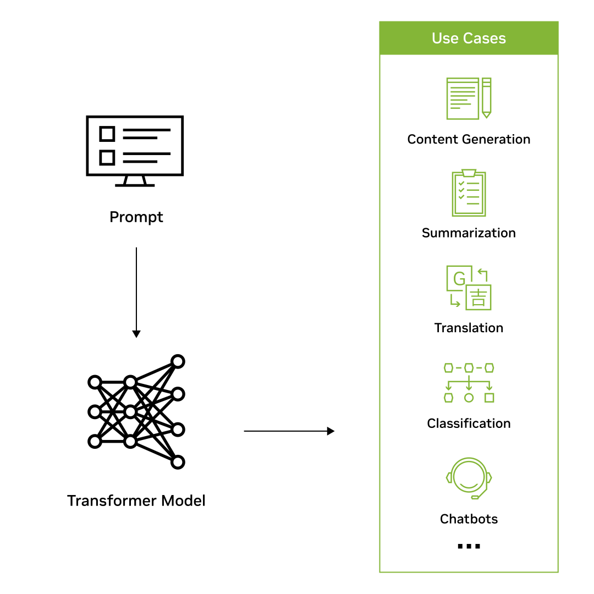
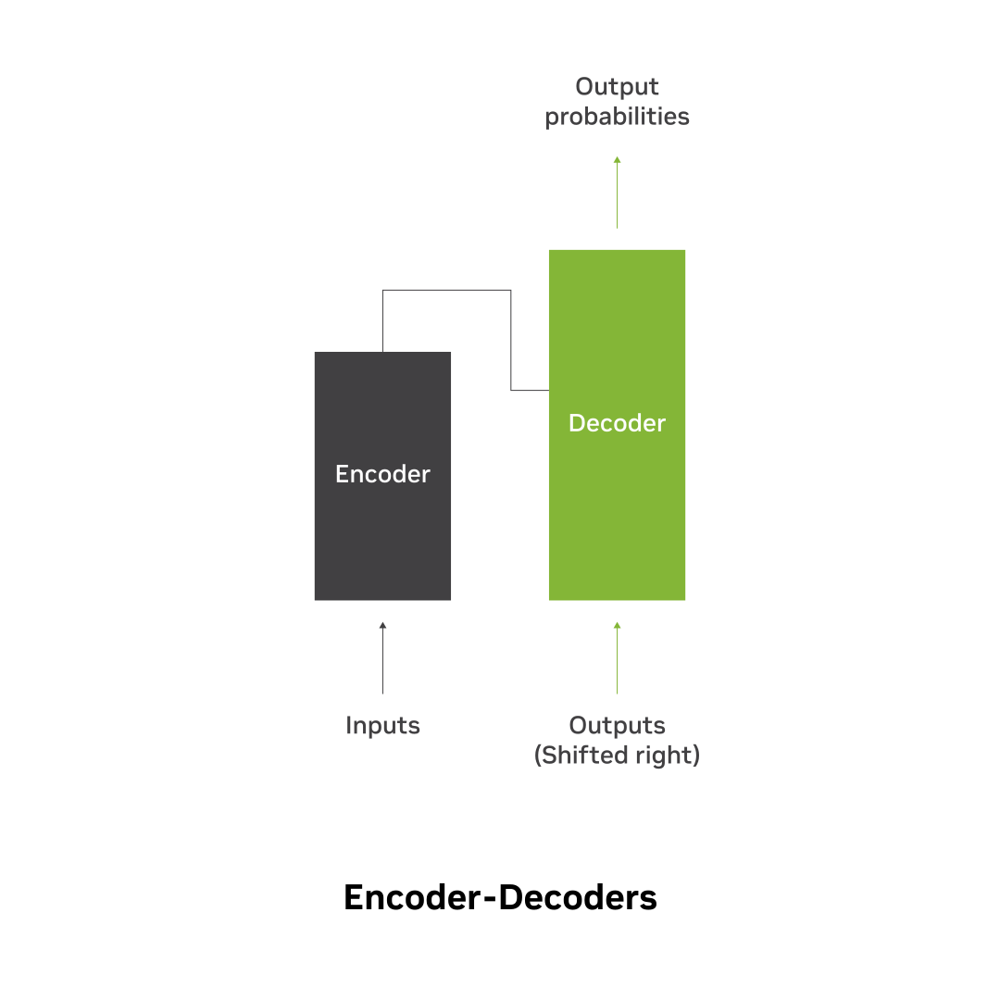
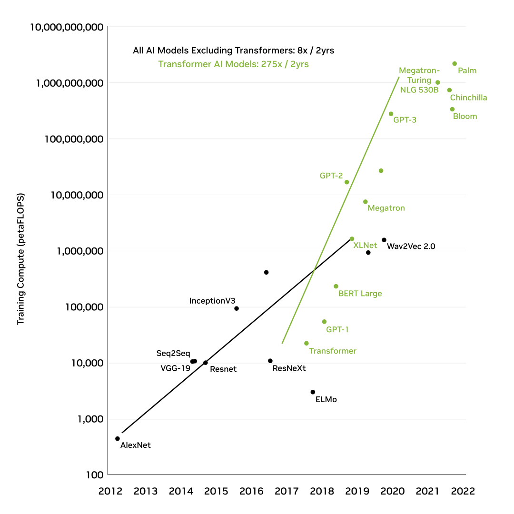

# [What are Large Language Models? | NVIDIA Glossary](https://www.nvidia.com/en-us/glossary/large-language-models/)

# Large Language Models Explained

Large language models (LLMs) are deep learning algorithms that can recognize, summarize, translate, predict, and generate content using very large datasets.

## What are Large Language Models?

[Large language models](https://www.nvidia.com/en-us/deep-learning-ai/solutions/large-language-models/) largely represent a class of deep learning architectures called [transformer networks](https://blogs.nvidia.com/blog/2022/03/25/what-is-a-transformer-model/). A transformer model is a neural network that learns context and meaning by tracking relationships in sequential data, like the words in this sentence.

A transformer is made up of multiple transformer blocks, also known as layers. For example, a transformer has self-attention layers, feed-forward layers, and normalization layers, all working together to decipher input to predict streams of output at inference. The layers can be stacked to make deeper transformers and powerful language models. Transformers were first introduced by Google in the 2017 paper [“Attention Is All You Need.”](https://arxiv.org/abs/1706.03762)

Figure 1. How transformer models work.

There are two key innovations that make transformers particularly adept for large language models: positional encodings and self-attention.

Positional encoding embeds the order of which the input occurs within a given sequence. Essentially, instead of feeding words within a sentence sequentially into the neural network, thanks to positional encoding, the words can be fed in non-sequentially.

Self-attention assigns a weight to each part of the input data while processing it. This weight signifies the importance of that input in context to the rest of the input. In other words, models no longer have to dedicate the same attention to all inputs and can focus on the parts of the input that actually matter. This representation of what parts of the input the neural network needs to pay attention to is learnt over time as the model sifts and analyzes mountains of data.

These two techniques in conjunction allow for analyzing the subtle ways and contexts in which distinct elements influence and relate to each other over long distances, non-sequentially.

The ability to process data non-sequentially enables the decomposition of the complex problem into multiple, smaller, simultaneous computations. Naturally, GPUs are well suited to solve these types of problems in parallel, allowing for large-scale processing of large-scale unlabelled datasets and enormous transformer networks.

## Why are Large Language Models Important?

Historically, AI models had been focused on perception and understanding.

However, large language models, which are trained on internet-scale datasets with hundreds of billions of parameters, have now unlocked an AI model’s ability to generate human-like content.

Models can read, write, code, draw, and create in a credible fashion and augment human creativity and improve productivity across industries to solve the world’s toughest problems.

The applications for these LLMs span across a plethora of use cases. For example, an AI system can learn the language of protein sequences to provide viable compounds that will help scientists develop groundbreaking, life-saving vaccines.

Or computers can help humans do what they do best—be creative, communicate, and create. A writer suffering from writer’s block can use a large language model to help spark their creativity.

Or a software programmer can be more productive, leveraging LLMs to generate code based on natural language descriptions.

## What are Large Language Model examples?

Advancements across the entire compute stack have allowed for the development of increasingly sophisticated LLMs. In June 2020, OpenAI released [GPT-3](https://arxiv.org/abs/2005.14165), a 175 billion-parameter model that generated text and code with short written prompts. [In 2021, NVIDIA and Microsoft  developed Megatron-Turing Natural Language Generation 530B](https://developer.nvidia.com/blog/using-deepspeed-and-megatron-to-train-megatron-turing-nlg-530b-the-worlds-largest-and-most-powerful-generative-language-model/), one of the world’s largest models for reading comprehension and natural language inference, with 530 billion parameters.

As LLMs have grown in size, so have their capabilities. Broadly, LLM use cases for text-based content can be divided up in the following manner:

1. Generation (e.g., story writing, marketing content creation)
2. Summarization (e.g., legal paraphrasing, meeting notes summarization)
3. Translation (e.g., between languages, text-to-code)
4. Classification (e.g., toxicity classification, sentiment analysis)
5. Chatbot (e.g., open-domain Q+A, virtual assistants)

Enterprises across the world are starting to leverage LLMs to unlock new possibilities: 

- [Medical researchers](https://blogs.nvidia.com/blog/2022/09/20/bionemo-large-language-models-drug-discovery/) train [large language models in healthcare](https://developer.nvidia.com/blog/building-generative-ai-pipelines-for-drug-discovery-with-bionemo-service/) on a corpus of data from textbooks, research papers and patient electronic health records for tasks like [protein structure prediction](https://developer.nvidia.com/blog/predict-protein-structures-and-properties-with-biomolecular-large-language-models-2/) that can uncover patterns in disease and predict outcomes.
- Retailers can leverage LLMs to provide stellar customer experiences to customers through dynamic chatbots.
- Developers can leverage [LLMs to write software](https://www.tabnine.com/) and [teach robots how to do physical tasks](https://www.deepmind.com/publications/a-generalist-agent).
- Financial advisors can use LLMs to summarize earnings calls and create transcripts of important meetings.
- Marketers can train an LLM to [organize customer feedback and requests into clusters or segment products into categories based on product descriptions.](https://www.businesswire.com/news/home/20220223005437/en/New-GPT-AI-Powered-Large-Language-Model-for-Banking-Increases-Financial-Services-Institutions-Competitiveness-and-Enables-Accelerated-Digital-Transformation-in-Weeks-Not-Years)

Large language models are still in their early days, and their promise is enormous; a single model with zero-shot learning capabilities can solve nearly every imaginable problem by understanding and generating human-like thoughts instantaneously. The use cases span across every company, every business transaction, and every industry, allowing for immense value-creation opportunities.

## How Do Large Language Models Work?

Large language models are trained using [unsupervised learning](https://blogs.nvidia.com/blog/2018/08/02/supervised-unsupervised-learning/). With unsupervised learning, models can find previously unknown patterns in data using unlabelled datasets. This also eliminates the need for extensive data labeling, which is one of the biggest challenges in building AI models.

Thanks to the extensive training process that LLMs undergo, the models don’t need to be trained for any specific task and can instead serve multiple use cases. These types of models are known as foundation models. 

The ability for the foundation model to generate text for a wide variety of purposes without much instruction or training is called zero-shot learning. Different variations of this capability include one-shot or few-shot learning, wherein the foundation model is fed one or a few examples illustrating how a task can be accomplished to understand and better perform on select use cases.

Despite the tremendous capabilities of zero-shot learning with large language models, developers and enterprises have an innate desire to tame these systems to behave in their desired manner. To deploy these large language models for specific use cases, the models can be customized using several techniques to achieve higher accuracy. Some techniques include [prompt tuning](https://developer.nvidia.com/blog/adapting-p-tuning-to-solve-non-english-downstream-tasks/), fine-tuning, and [adapters](https://docs.nvidia.com/deeplearning/nemo/user-guide/docs/en/v1.10.0/core/adapters/intro.html).

Figure 2. Image shows the structure of encoder-decoder language models.

There are several classes of large language models that are suited for different types of use cases:

- **Encoder only**: These models are typically suited for tasks that can understand language, such as classification and sentiment analysis. Examples of encoder-only models include BERT (Bidirectional Encoder Representations from Transformers).
- **Decoder only**: This class of models is extremely good at generating language and content. Some use cases include story writing and blog generation. Examples of decoder-only architectures include GPT-3 (Generative Pretrained Transformer 3).
- **Encoder-decoder**: These models combine the encoder and decoder components of the transformer architecture to both understand and generate content. Some use cases where this architecture shines include translation and summarization. Examples of encoder-decoder architectures include T5 (Text-to-Text Transformer).

## What are the Challenges of Large Language Models?

The significant capital investment, large datasets, technical expertise, and large-scale compute infrastructure necessary to develop and maintain large language models have been a barrier to entry for most enterprises.

Figure 3. Compute required for training transformer models.

1. **Compute-, cost-, and time-intensive workload**: Significant capital investment, technical expertise, and large-scale compute infrastructure are necessary to maintain and develop LLMs. Training an LLM requires thousands of GPUs and weeks to months of dedicated training time. Some estimates indicate that a single training run for a GPT-3 model with 175 billion parameters, trained on 300 billion tokens, may [cost over $12 million dollars in just compute](https://direct.mit.edu/tacl/article/doi/10.1162/tacl_a_00413/107387/Compressing-Large-Scale-Transformer-Based-Models-A).
2. **Scale of data required**: As mentioned, training a large model requires a significant amount of data. Many companies struggle to get access to large enough datasets to train their large language models. This issue is compounded for use cases that require private—such as financial or health—data. In fact, it’s possible that the data required to train the model doesn’t even exist.
3. **Technical expertise**: Due to their scale, training and deploying large language models are very difficult and require a strong understanding of deep learning workflows, transformers, and distributed software and hardware, as well as the ability to manage thousands of GPUs simultaneously.

## How Can You Get Started With Large Language Models?

NVIDIA offers tools to ease the building and deployment of large language models:

- [NVIDIA NeMo Service](https://www.nvidia.com/en-us/gpu-cloud/nemo-llm-service/), part of NVIDIA AI Foundations, is a Cloud service for enterprise hyper-personalization and at-scale deployment of intelligent large language models.
- [NVIDIA BioNeMo Service](https://www.nvidia.com/en-us/gpu-cloud/bionemo/), part of NVIDIA AI Foundations, is a cloud service for generative AI in drug discovery that allows researchers to customize and deploy domain-specific, state-of-the-art generative and predictive biomolecular AI models at scale.
- [NVIDIA Picasso Service](https://www.nvidia.com/en-us/gpu-cloud/picasso/), part of the NVIDIA AI Foundations, is a cloud service for building and deploying generative AI-powered image, video and 3D applications.
- [NVIDIA NeMo](https://www.nvidia.com/en-us/ai-data-science/generative-ai/nemo-framework/) framework , part of the NVIDIA AI platform, is an end-to-end, cloud-native enterprise framework to build, customize, and deploy generative AI models with billions of parameters.

Despite the challenges, the promise of large language models is enormous. NVIDIA and its ecosystem is committed to enabling consumers, developers, and enterprises to reap the benefits of large language models.

## Next Steps

### Explore Our LLM Solutions

Find out how NVIDIA is helping to democratize large language models for enterprises through our LLMs solutions.

[Learn More about LLMs](https://www.nvidia.com/en-us/deep-learning-ai/solutions/large-language-models/)

### Watch LLM Videos and Tutorials on Demand

This playlist of free large language model videos includes everything from tutorials and explainers to case studies and step-by-step guides.

[Explore LLM Videos and Tutorials](https://www.nvidia.com/en-us/on-demand/search/?facet.mimetype%5B%5D=event%20session&layout=list&page=1&q=large%20language%20model&sort=relevance&sortDir=desc)

### Deepen Your Technical Knowledge of LLMs

Learn more about developing large language models on the NVIDIA Technical Blog.

[Read LLM Technical Blogs](https://developer.nvidia.com/blog/?tags=large-language-models&categories=)
