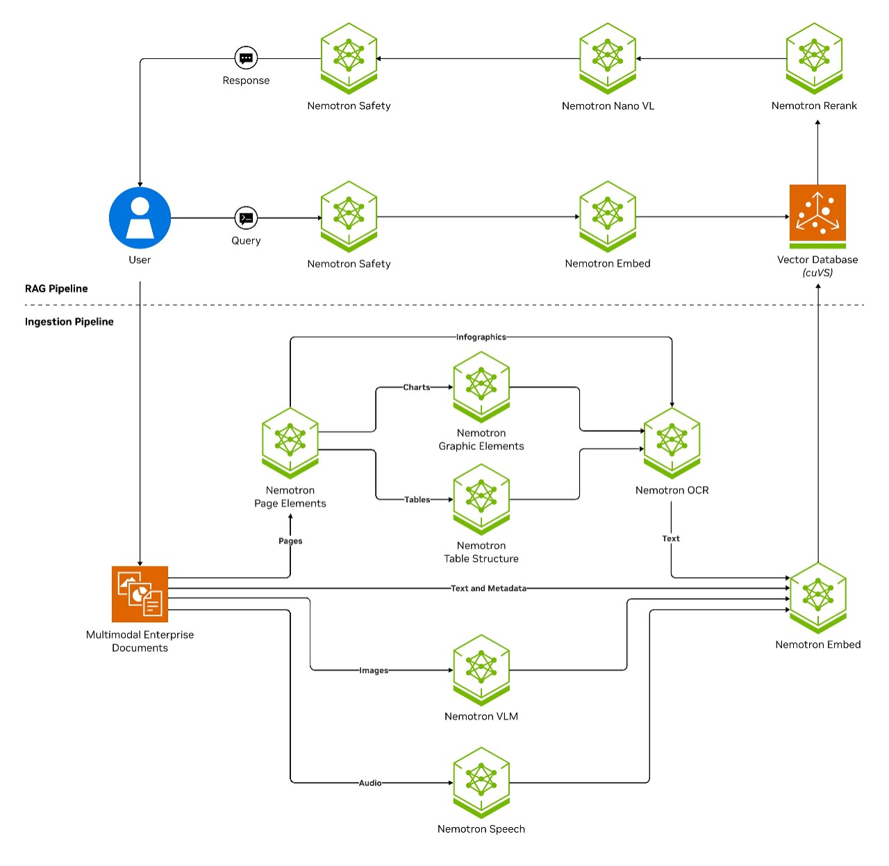
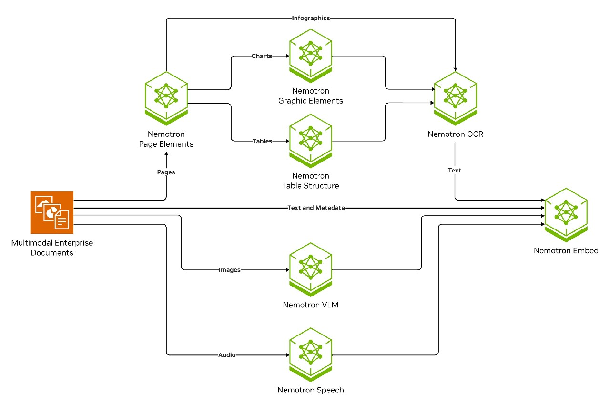
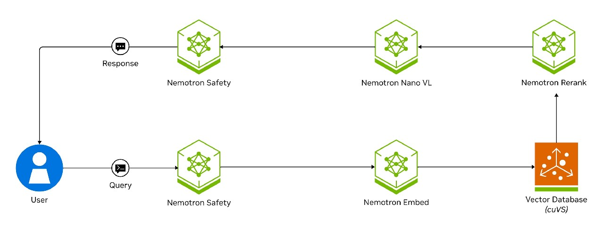
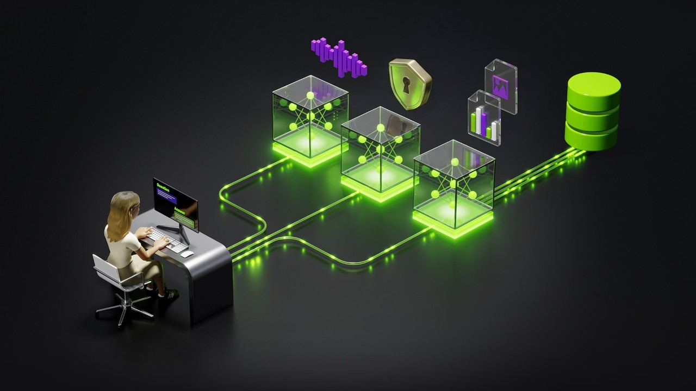

# [NVIDIA Glossary: What is Retrieval-Augmented Generation (RAG)?](https://www.nvidia.com/en-us/glossary/retrieval-augmented-generation/)

# What Is Retrieval-Augmented Generation (RAG)?

[Retrieval-augmented generation](https://blogs.nvidia.com/blog/what-is-retrieval-augmented-generation/) (RAG) is an AI technique where an external data source is connected to a [large language model](https://www.nvidia.com/en-us/glossary/large-language-models/) (LLM) to generate domain-specific or the most up-to-date responses in real time.

- [How It Works](#how-it-works)
- [Applications and Use Cases](#app-and-uses)
- [Benefits](#benefits)
- [Challenges and Solutions](#challenges)
- [Next Steps](#next-steps)

- [How It Works](#how-it-works)
- [Applications and Use Cases](#app-and-uses)
- [Benefits](#benefits)
- [Challenges and Solutions](#challenges)
- [Next Steps](#next-steps)

- [How It Works](#how-it-works)
- [Applications and Use Cases](#app-and-uses)
- [Benefits](#benefits)
- [Challenges and Solutions](#challenges)
- [Next Steps](#next-steps)

## How Does RAG Work?

LLMs are powerful, but their knowledge is limited to their pretraining data. This poses a challenge for businesses needing AI applications that rely on their own specific documents and data.

RAG addresses this limitation by supplementing LLMs with external data. This technique retrieves relevant information from diverse structured and unstructured sources, including text, images, and video, to ground LLM responses in a company's proprietary data––improving accuracy and reducing hallucinations. This active retrieval—often facilitated by vector databases for efficient semantic search—enables LLMs to provide more informed, contextually relevant answers than if they relied solely on their pretraining.

In short, RAG works as follows:

- A user's query is encoded into a vector representation.
- The system searches for semantically similar data.
- The most relevant retrieved information is added to the model's context.
- A response is generated and grounded in the retrieved data.

RAG allows you to integrate specialized knowledge without retraining the LLM entirely, saving on compute resources

### Semantic Search Versus Keyword Search

Keyword search focuses on finding exact matches to the words or phrases a user enters, treating the query literally and with a limited understanding of synonyms or context. For example, a keyword search for "best running shoes for flat feet" may only return results containing that exact phrase.

Conversely, semantic search aims to understand the meaning and intent behind the query by analyzing context and relationships between words and user history to deliver more relevant results. A semantic search for "best running shoes for flat feet" may return results for "stability running shoes," "arch support running shoes," or even reviews of specific shoe models suitable for flat feet, even if those exact keywords weren't used in the search query.

Essentially, keyword search looks for the words, while semantic search looks for the meaning.

### What Is Information Retrieval, and How Does It Differ From RAG?

Information retrieval is the process of finding relevant documents or data based on a user query. It uses algorithms like BM25, TF-IDF, and vector search to return a list of sources, which users must then review manually for insights. Instead of just returning documents, RAG synthesizes a direct response using the retrieved data, reducing the need for manual interpretation. While information retrieval focuses on finding relevant content, RAG uses that content to generate context-aware, coherent answers in real time.

### What Are the Key Components of a RAG Architecture?

A typical RAG pipeline works in three steps: extraction (where data gets ingested and embedded), retrieval (where relevant information is found), and generation (where answers are created). Each phase is critical in ensuring a RAG pipeline retrieves precise, reliable, and relevant data.

**Extraction**

During the extraction phase, enterprise data is collected, transformed, indexed, and stored in a vector database. In this phase, an embedding model converts textual, audio, or visual content into high-dimensional vector representations, enabling similarity-based searches. Embedding vectors are indexed (e.g., as graphs) before storage for fast retrieval using approximate nearest neighbor (ANN) methods.

**Retrieval**

Retrieval identifies and retrieves relevant data using vector and keyword search techniques. Many RAG systems also use a reranking model to identify which of the retrieved data is most relevant. Appending a reranking model to the retrieval phase helps the RAG system improve the overall accuracy of the final response generation.

**Generation**

Finally, during the generation phase, LLMs combine the user’s prompt with retrieved data to craft answers that are simultaneously semantic and contextually precise. This combination gives RAG a distinct edge over LLM-only solutions.

A RAG architecture diagram showing three phases: data extraction, retrieval, and generation—powered by NVIDIA NeMo™ Retriever Extraction open library and Nemotron, accelerated with NVIDIA cuVS.

### How Does Data Extraction Work in RAG?

In a RAG pipeline, data extraction involves data collection, embedding generation, and indexing.

**Data Collection**

First, you must collect, parse, and clean your data—documents, PDFs, product catalogs, images, or even audio transcripts. Text is often chunked into paragraphs or sections to limit the context window and maximize retrieval accuracy. High-quality extraction involving accurate metadata and minimal duplication is crucial because even the most advanced LLMs will struggle if the underlying data is incomplete or disorganized.

Your data sources will indicate the ideal data collection method:

- **Batch**: Ideal for stable or static datasets. Process embeddings in bulk.
- **Streaming**: Suited for continually updated data (e.g., social media, news).

**Embedding Generation**

During the extraction phase, an embedding model transforms data into vector embeddings. Vector embeddings are numerical representations of data—such as text, images, or audio—mapped into a high-dimensional space. These embeddings capture the semantic meaning of content, enabling similarity-based retrieval in RAG. Items with related meanings are placed closer together in the vector space, allowing for fast and efficient searches.

For example, in a search system, a query like "fast GPU for deep learning" retrieves documents with similar embeddings, ensuring contextually relevant results. High-quality embeddings are critical for accurate and meaningful retrieval in AI applications.

**Indexing**

Finally, once embeddings are created and inserted, the system indexes the data in a vector database. Vector databases are at the core of RAG systems and are needed to efficiently store information as data chunks, each represented by a corresponding multidimensional vector produced by an embedding model. These databases can handle the complexities and specificities of vector space operations, like cosine similarity, offering several key advantages such as efficient similarity search, handling high-dimensional data, scalability, real-time processing, and enhanced search relevance.

Architecture diagram showing data being extracted in a RAG pipeline and a GPU-accelerated vector database—powered by NVIDIA NeMo Retriever Extraction open library and Nemotron.

### What Type of Data Is Extracted in RAG?

Because RAG is not limited to text, it can also process images, audio, and video inputs by converting them into embeddings using [computer vision](https://www.nvidia.com/en-us/glossary/computer-vision/) and speech-processing models. This enables cross-modal retrieval, where users can query across data types. For instance, an ecommerce platform might embed both product descriptions and product images, so users can search visually (“Find images similar to this reference photo”) and textually. By supporting diverse data formats, enterprise and consumer applications are becoming smarter.

Multilingual models (embedding and LLM) used in RAG enable global accessibility for enterprise [generative AI](https://www.nvidia.com/en-us/glossary/generative-ai/) applications supporting queries and documents in different languages.

### How Does Retrieval Work in RAG?

Retrieval identifies the most relevant data to enhance an LLM’s response. The process often begins with **query rewriting**, where the original search query is automatically refined. This can involve expanding it with synonyms, resolving ambiguities, or incorporating context from previous interactions to improve retrieval accuracy.

Next, the query is converted into an **embedding**—a numeric vector representation—using an embedding model. This transformation ensures compatibility with stored data embeddings, making it essential to maintain consistency between ingestion-time and query-time embeddings.

Finally, the system performs a **similarity search**, retrieving the top-k most relevant chunks by measuring vector distances using metrics such as cosine similarity, Euclidean distance, or dot product. ANN algorithms optimize this step by efficiently narrowing down potential matches. The retrieved content—whether text, image, or other data—then provides crucial context for the LLM’s final response.

Architecture diagram showing retrieval in a RAG pipeline with a GPU-accelerated vector database—powered by NVIDIA Nemotron and NVIDIA cuVS.

After retrieval, a **reranking** step follows to refine the results by prioritizing the most relevant data using a reranking model. This can be based on recency, domain relevance, or user preferences. Reranking models—whether heuristic-based or machine learning (ML)-powered—improve retrieval recall, ensuring that the LLM processes the highest-quality information first.

### What Is a Reranking Model?

A reranking model refines retrieved results by prioritizing the most relevant chunks before passing them to the LLM. After initial retrieval, reranking models reorder content based on relevance signals, such as keyword frequency, semantic similarity, recency, or metadata alignment. They can be rule-based (heuristics like BM25), ML-driven (learned relevance models), or hybrid approaches that combine multiple factors. Effective reranking ensures that the LLM processes the most useful data first, improving response accuracy and efficiency in RAG systems.

### What Are Advanced Retrieval Techniques?

To optimize LLM responses, there are advanced retrieval techniques that help enhance search precision by combining methods, managing large data, and adapting to query nuances.

| Advanced Retrieval Techniques | |
| --- | --- |
| Hybrid Retrieval | This approach combines vector search with traditional techniques like BM25. |
| Long Context Retrieval | Some LLMs can process thousands of tokens in a single prompt, allowing them to consider large amounts of retrieved content. This is especially useful in research, legal, and technical domains where responses require multiple sources. However, longer prompts increase computational costs and memory usage. |
| Contextual Retrieval | Adding additional context to each chunk through metadata like what document it’s part of, a summary of the surrounding context, or the date the chunk was indexed is another way to increase the likelihood of the correct context being retrieved by the retrieval pipeline. This method, coined “contextual retrieval,” is extremely useful when dealing with complex multi-source documents, like coding repositories, legal documents, and scientific research papers. |

### How Does Generation Work in RAG?

Once relevant information is retrieved, the generation phase in RAG involves synthesizing a final response using an LLM. This process includes:

- LLM-Based Synthesis: The retrieved top-k chunks are inserted into the model’s prompt alongside the user query. The LLM then generates a response by grounding its output in the retrieved data, reducing hallucinations, and improving factual accuracy. Many enterprise RAG systems enhance transparency by citing or hyperlinking sources within the generated text.
- Summarization and Reasoning: In knowledge-heavy fields (e.g., medicine, law, research), RAG can summarize information from multiple sources, presenting it in structured formats like bullet points or concise paragraphs. This allows users to quickly grasp key insights without manually parsing multiple documents. Advanced RAG implementations also enable the model to reason over-retrieved content, synthesizing coherent and contextually rich responses.
- Output Validation: In high-stakes applications, an additional validation step ensures that the generated response remains faithful to the retrieved context. This can involve:
  - Comparing the output against the retrieved text to check for inconsistencies.
  - Using a secondary LLM to verify claims made by the first model.
  - Logging the generated response alongside its references for auditability and compliance.

By structuring responses around verified, retrieved information, RAG enhances the reliability and transparency of AI-generated content.

### What Is Agentic RAG?

Agentic RAG pipelines benefit complex applications that require contextually rich responses, like customer support tools, legal services, and enterprise knowledge management.

While simple retrieval can work for some applications, consider [agentic AI](https://blogs.nvidia.com/blog/what-is-agentic-ai/) workflows that include multiple [AI agents](https://www.nvidia.com/en-us/glossary/ai-agents/) working together to achieve a common goal. For example, software design, IT automation, and code generation are applications that warrant extensive data extraction and processing to ensure accuracy. An advanced RAG pipeline can include multiple passes of retrieval, reasoning, and tuning of response outputs based on criteria to ensure an optimal generated response that suits your business goals.

#### Build a Voice Agent With RAG and Safety Guardrails

In this tutorial, you’ll learn how to build a voice-powered RAG agent with guardrails using the latest NVIDIA Nemotron™ models.

[Get Started](https://developer.nvidia.com/blog/how-to-build-a-voice-agent-with-rag-and-safety-guardrails/)

Quick Links

[What Is Retrieval-Augmented Generation, aka RAG?](https://blogs.nvidia.com/blog/what-is-retrieval-augmented-generation/)

[Improve Accuracy in Multimodal Search and Visual Document Retrieval With Llama Nemotron RAG Models](https://huggingface.co/blog/nvidia/llama-nemotron-vl-1b)

## Applications and Use Cases of RAG

### Enterprise Search and Knowledge Management

Enhances internal search by retrieving and synthesizing information from vast corporate documents, wikis, and knowledge bases, reducing time spent searching for answers.

### Financial and Market Intelligence

Helps analysts by retrieving and summarizing real-time market trends, company reports, and regulatory filings for informed decision-making.

### Customer Support and Chatbots

Powers AI-driven virtual assistants that provide accurate, up-to-date responses by retrieving company policies, FAQs, and troubleshooting guides instead of relying solely on pretrained knowledge.

### Healthcare and Medical Research

Supports clinicians and researchers by retrieving and summarizing the latest medical studies, clinical guidelines, and patient records to assist in decision-making.

### Legal and Compliance Assistance

Retrieves and synthesizes legal documents, case law, and regulatory guidelines to aid lawyers and compliance teams in research and contract analysis.

### Code and Software Documentation

Assists developers by retrieving relevant code snippets, API documentation, and troubleshooting solutions from repositories and technical guides.

## What Are the Benefits of RAG?

### Improved Factual Accuracy

By retrieving information from a reliable, up-to-date data source, RAG reduces the model’s tendency to “hallucinate” and helps ensure that generated responses are grounded in real facts.

### Flexibility and Domain Adaptation

RAG can be easily tailored to different domains or knowledge bases without having to completely retrain or fine-tune the generative model. You simply change or update the data source(s) from which relevant information is retrieved.

### Up-to-Date Information

RAG enables the system to provide responses based on the latest data sources. Traditional LLMs are typically trained on static snapshots of data; RAG keeps the answers current by “pulling in” new data as it appears.

### Interpretability and Transparency

Users and developers can examine which documents or knowledge sources were retrieved and used in generating a response. This helps trace and verify the information provided, increasing trust and explainability.

## Challenges and Solutions

Quick Links

[Explore Accelerated Models using NVIDIA NIM™ APIs](https://build.nvidia.com/models)

## How Do You Improve the Accuracy of RAG?

There are multiple ways to improve the accuracy of a RAG pipeline, ranging from parametric methods (like fine-tuning) to non-parametric pipeline modifications.

**Solutions**

- **Model Selection**: Choosing the best model for your RAG pipeline has a heavy impact on the pipeline’s accuracy. Ensure you’re using the best model for each function (embedding model, reranking model, and generator) to increase the overall accuracy performance of many RAG pipelines.
- **Fine-tuning**: A common way to improve RAG accuracy is to fine-tune your generator (the LLM responsible for producing final responses) and/or your embedding model (used to power retrieval and extraction). By capturing user feedback on the generated responses, you could set up a data flywheel that automatically fine-tunes your generator model.
- **Reranking**: Using a reranking model helps you select the most relevant context for answering a user query. This method will add a small amount of additional latency but typically has an outsized impact on accuracy.
- **RAG “Hyperparameters”**: By modifying and experimenting with different RAG hyperparameters, such as chunk size, chunk overlap, and embedding vector size, you can improve the RAG pipeline tremendously. These methods require robust evaluation (like through NeMo Evaluator microservice) but can be extremely impactful on pipeline accuracy.
- **Query Augmentation**: By adding methods like query transformation, rewriting, or otherwise, you can improve the effectiveness of your RAG pipeline by ensuring the query is suitable for the specific pipeline you have created for any domain.

## How Can You Accelerate RAG?

RAG pipelines, which combine the strengths of LLMs with external knowledge sources, can experience performance gains by employing several techniques:

**Solutions**

- Using smaller, fine-tuned models

  - Instead of relying exclusively on LLMs, employ specialized, smaller models (fine-tuned for specific tasks) to generate final responses.
  - Reduces computational overhead and speeds up the generation process
- Leveraging GPU-accelerated databases

  - Offload retrieval tasks to GPU-accelerated systems for rapid access to context.
  - Significantly cuts down latency during the data retrieval phase.
- Optimizing indexing structures
- Caching frequently accessed data

## How Can You Get Started With RAG?

To get started building sample RAG applications, download the [NVIDIA AI Blueprint](https://build.nvidia.com/nvidia/build-an-enterprise-rag-pipeline) for building enterprise-grade RAG pipelines. This reference architecture provides developers with a foundational starting point for building scalable and customizable retrieval pipelines that deliver high accuracy and throughput.

It integrates state-of-the-art NVIDIA technologies, including NVIDIA Nemotron for extraction, embedding, and reranking, and the [NVIDIA cuVS library](https://developer.nvidia.com/cuvs?sortBy=developer_learning_library%2Fsort%2Ftitle%3Aasc) for accelerated data processing and cost-efficient, scalable RAG solutions. Nemotron RAG is a collection of open models, datasets, libraries, and training scripts for building and customizing information retrieval systems.​ This openness enables deep customization and helps organizations innovate faster with security and transparency.

To connect AI agents to large amounts of diverse data, build an AI query engine. Get started with [AI-Q—the NVIDIA Blueprint](https://build.nvidia.com/nvidia/aiq) for building AI agents—powered by the [RAG blueprint](https://build.nvidia.com/nvidia/build-an-enterprise-rag-pipeline) and Nemotron. Additionally, developers can use the open source [NVIDIA NeMo Agent Toolkit](https://developer.nvidia.com/nemo-agent-toolkit) to efficiently connect teams of agents and optimize agentic AI systems.

Taking RAG applications to production presents challenges like data curation, governance, security, scalability, and deployment complexity. NVIDIA AI Enterprise simplifies development and deployment by offering powerful tools and technologies, including NVIDIA blueprints, [NVIDIA NeMo](https://www.nvidia.com/en-us/ai-data-science/products/nemo/), and [NVIDIA NIM™.](https://developer.nvidia.com/nim) Sign up for a 90-day free trial to access enterprise-grade security and robust support needed to scale AI confidently.

## Next Steps

### Ready to Get Started?

Learn how to build RAG AI agents with NVIDIA Nemotron, a family of open source models with open weights, training data, and recipes, by reviewing this learning path.

[Build a RAG AI Agent](https://developer.nvidia.com/topics/ai/how-to-build-an-agentic-rag)

### Get Started Building Enterprise RAG Applications

Connect AI applications to enterprise data using industry-leading embedding and reranking models for information retrieval at scale.

[Explore the NVIDIA AI Blueprint](https://build.nvidia.com/nvidia/build-an-enterprise-rag-pipeline)

### Access RAG Tools and Technology

Explore the RAG topic page for developers to access the latest RAG tools, technology, and additional RAG learning resources.

[Get Started With RAG](https://developer.nvidia.com/topics/ai/retrieval-augmented-generation)
