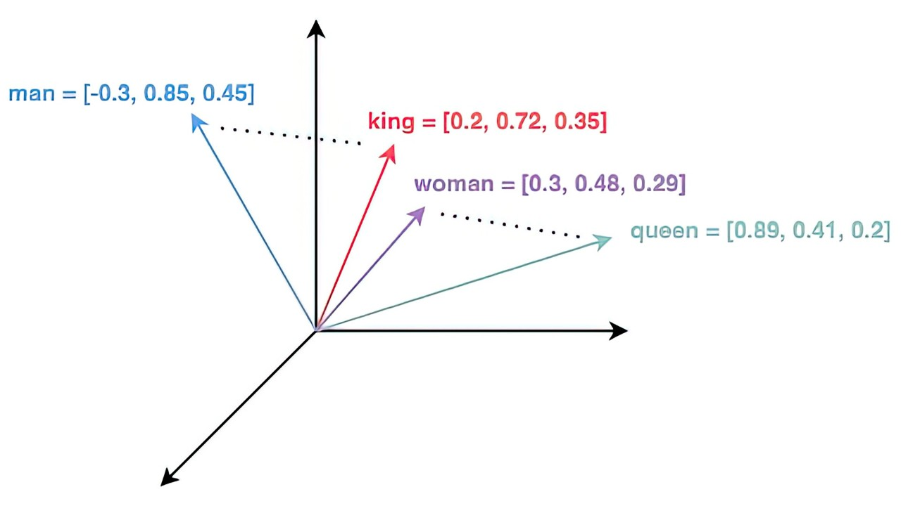
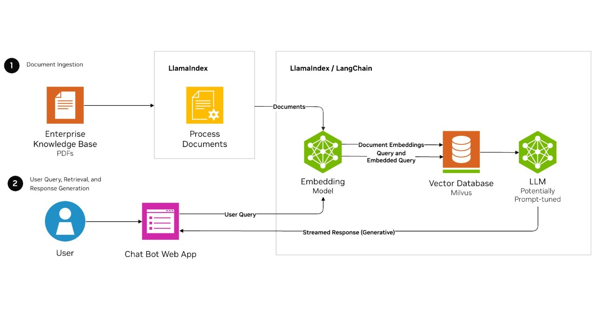
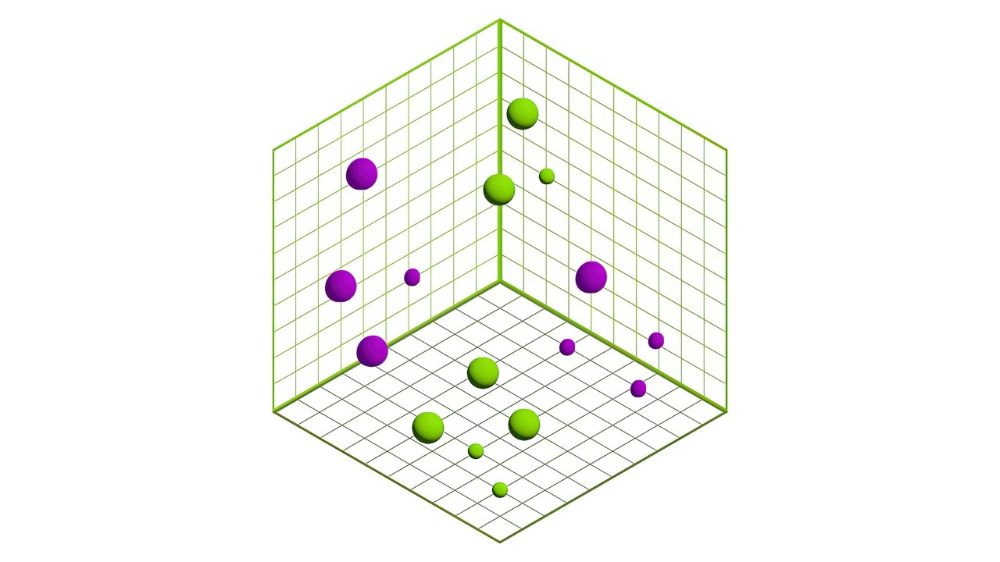
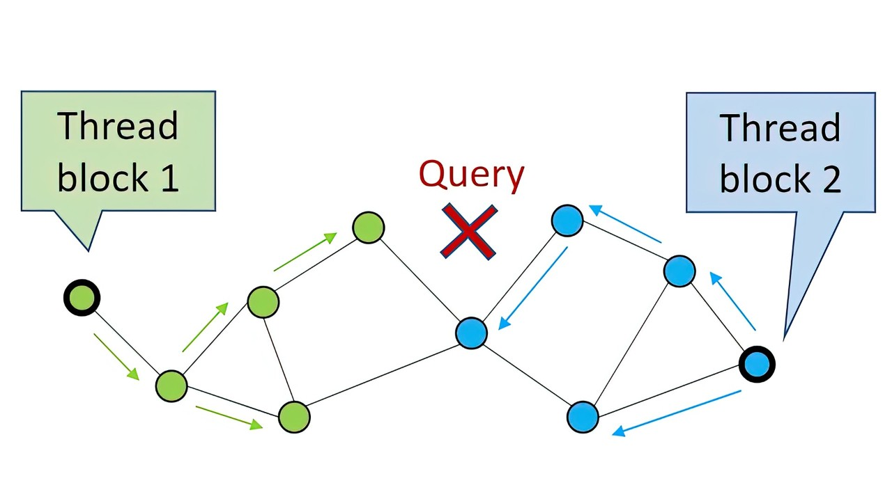
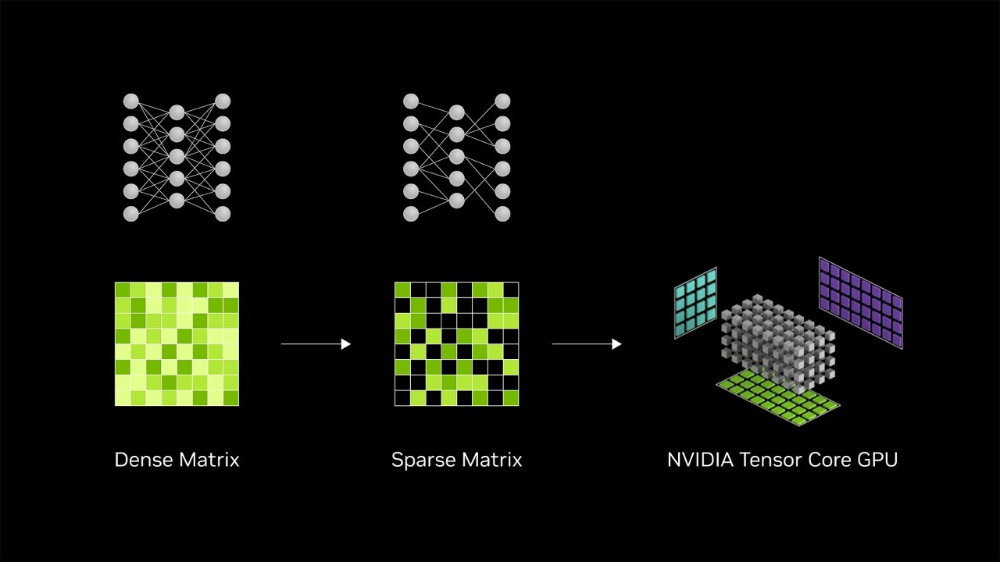

# [NVIDIA Glossary: What is a Vector Database?](https://www.nvidia.com/en-us/glossary/vector-database/)

# What is a Vector Database?

A vector database is an organized collection of vector embeddings that can be created, read, updated, and deleted at any point in time. Vector embeddings represent chunks of data, such as text or images, as numerical values.

## What is an Embedding Model?

An [embedding model](https://docs.nvidia.com/nim/nemo-retriever/text-embedding/latest/overview.html) transforms diverse data, such as text, images, charts, and video, into numerical vectors in a way that captures their meaning and nuance in a multidimensional vector space. The selection among embedding techniques depends on application needs, balancing factors like semantic depth, computational efficiency, the types of data to be encoded, and dimensionality.

A vector space into which the words man, king, woman, and queen have been mapped. Source: [baeldung](https://www.baeldung.com/cs/dimensionality-word-embeddings).

This mapping of vectors into a multidimensional space allows for a nuanced analysis of semantic similarities of vectors, significantly enhancing the precision of searches and data categorization. Embedding models play a vital role in AI applications that use [AI chatbots](https://info.nvidia.com/building-intelligent-ai-chatbots-using-rag-webinar.html), [large language models (LLMs)](https://www.nvidia.com/en-us/glossary/large-language-models/), and [retrieval-augmented generation (RAG)](https://www.nvidia.com/en-us/glossary/retrieval-augmented-generation/) with vector databases, as well as search engines and many other use cases.

## How Are Embedding Models Used With Vector Databases?

When private enterprise data is ingested, it’s chunked, a vector is created to represent it, and the data chunks with their corresponding vectors are stored in a vector database along with optional metadata for later retrieval.

Embedding models are used for ingesting data and understanding user prompts.

Upon receiving a query from the user, chatbot, or AI application, the system parses it and uses an embedding model to get vector embeddings representing parts of the prompt. The prompt’s vectors are then used to do semantic searches in a vector database for an exact match or the top-K most similar vectors along with their corresponding data chunks, which are placed into the context of the prompt before sending it to the LLM. LangChain or LlamaIndex are popular open-source frameworks to support the creation of AI chatbots and LLM solutions. Popular LLMs include OpenAI GPT and Meta LlaMA. Popular vector databases include Pinecone and Milvus, among many others. The two most popular programming languages are Python and TypeScript.

## What is Similarity Search in Vector Databases?

Similarity search, also known as vector search, vector similarity, or semantic search, refers to the process when an AI application efficiently retrieves vectors from the database that are semantically similar to a given query’s vector embeddings based on a specified similarity metric such as:

- **Euclidean distance:** Measures direct distances between points. Useful for clustering or classifying dense feature sets where overall differences matter.
- **Cosine similarity:** Focuses on the angle between vectors. Ideal for text processing and information retrieval, capturing semantic similarities based on orientation rather than traditional distance.
- **Manhattan distance:** Calculates the sum of absolute differences in Cartesian coordinates. Suited for pathfinding and optimization problems in grid-like structures. Useful with sparse data.

Similarity measurement metrics enable [efficient retrieval](https://rapids.ai/cuvs/) of relevant items in AI chatbots, recommendation systems, and document retrieval, enhancing user experiences by leveraging semantic relationships in the data to inform generative AI processes and perform [natural language processing (NLP).](https://www.nvidia.com/en-us/glossary/natural-language-processing/)

## What Are Clustering Algorithms in Vector Search?

Clustering algorithms organize vectors into cohesive groups based on shared characteristics, facilitating pattern recognition and anomaly detection within vector databases.

A 3D graphic shows clustered vectors, which in practice are multidimensional.

This process not only aids in data compression by reducing dataset size but also reveals underlying patterns, offering invaluable insights across various domains.

- **[K-means](https://medium.com/rapids-ai/combining-speed-scale-to-accelerate-k-means-in-rapids-cuml-8d45e5ce39f5):** Splits data into K clusters based on centroid proximity. Efficient for large datasets. Requires predefined cluster count.
- **DBSCAN and [HDBSCAN](https://developer.nvidia.com/blog/gpu-accelerated-hierarchical-dbscan-with-rapids-cuml-lets-get-back-to-the-future/):** Forms clusters based on density, distinguishing outliers. Adapts to complex shapes without specifying cluster numbers.
- **[Hierarchical clustering](https://arxiv.org/abs/2306.16354):** Creates a cluster tree by agglomeratively merging or divisively splitting data points. Suitable for hierarchical data visualization.
- **[Spectral clustering](https://developer.nvidia.com/blog/fast-spectral-graph-partitioning-gpus/):** Utilizes similarity matrix eigenvalues for dimensionality reduction. Effective for non-linear separable data.
- **Mean shift:** Identifies clusters by finding density function maxima. Flexible with cluster shapes and sizes. No need for predefined cluster count.

The diversity of algorithmic approaches caters to different data types and clustering objectives, underscoring the versatility and critical importance of clustering in extracting meaningful information from vector data in [RAG](https://developer.nvidia.com/blog/rag-101-retrieval-augmented-generation-questions-answered/) architectures.

## What is the Role of Indexing in Vector Databases?

Indexing in vector databases plays a crucial role in enhancing the efficiency and speed of search operations within high-dimensional data spaces. Given the complexity and volume of data stored in vector databases, indexing mechanisms are essential for quickly locating and retrieving vectors most relevant to a query. Here's a breakdown of the key functions and benefits of indexing in vector databases:

- **Efficient search operations:** Indexing structures, such as K-D trees, VP-trees, or inverted indexes, enable faster search operations by organizing data in a manner that reduces the need to perform exhaustive searches across the entire dataset.
- **Scalability:** As the volume of data grows, indexing helps maintain performance levels by ensuring that search operations can scale efficiently with the size of the database.
- **Reduced latency:** By facilitating quicker searches, indexing significantly reduces the latency between a query and its corresponding results, which is critical for applications requiring real-time or near-real-time responses.
- **Support for complex queries:** Advanced indexing techniques support more complex queries, including nearest-neighbor searches, range queries, and similarity searches, by efficiently navigating the high-dimensional space.
- **Optimized resource usage:** Effective indexing minimizes the computational resources required for searching, which can lead to cost savings and improved system sustainability, especially in cloud-based or distributed environments.

In summary, indexing is fundamental to the performance and functionality of vector databases, enabling them to manage and search through large volumes of complex, high-dimensional data quickly and effectively. This capability is vital for a wide range of applications, from recommendation systems and personalization engines to AI-driven analytics and content retrieval systems. [RAPIDS cuVS](http://www.rapids.ai/cuvs) provides GPU-acceleration that can reduce index construction time from days to hours.

## What is Query Processing in Vector Databases?

The query processor for a vector database is radically different from the architectures used in traditional relational databases. The efficiency and precision of [query processing](https://developer.nvidia.com/blog/accelerating-vector-search-fine-tuning-gpu-index-algorithms/) in vector databases hinge on sophisticated steps, including parsing, optimizing, and executing queries.

The CAGRA algorithm is an example of parallel programming.

Handling complex operations such as nearest-neighbor identification and similarity searches demands the use of advanced indexing structures, with parallel processing algorithms, such as [CAGRA](https://arxiv.org/abs/2308.15136) in cuVS, to further augment the system's capability to efficiently manage large-scale data.

This comprehensive approach ensures that vector databases can respond promptly and accurately to user queries, maintaining quick response times and high levels of accuracy in information retrieval. The user query is processed to harvest its embeddings, which are then used to query the vector database for semantically similar embeddings (vectors) efficiently.

## What Influences Scalability for Vector Databases?

GPU acceleration in vector databases, such as through libraries like RAPIDS cuVS,  is crucial for handling increasing data volumes and computational demands without compromising performance. It ensures these databases can adapt to the growing complexity typical in AI and big data analytics, employing two primary strategies: vertical and horizontal scaling behind an API.

Vertical scaling enhances capacity by upgrading computational resources, allowing for larger datasets and more complex operations within the same machine. Horizontal scaling distributes data and workloads across multiple servers, enabling the system to manage greater request volumes and ensuring high availability for fluctuating demands.

Optimized algorithms and parallel processing, particularly through GPUs, are key to efficient scalability. These approaches minimize system load by streamlining data processing and retrieval tasks. GPUs, with their parallel processing capabilities, are especially valuable, accelerating data-intensive computations and enabling databases to maintain high-performance levels as they scale across nodes.

## What is Data Normalization in Vector Databases?

Data normalization in vector databases involves adjusting vectors to a uniform scale, a critical step for ensuring consistent performance in distance-based operations, such as clustering or nearest-neighbor searches. Common techniques like min-max scaling, which adjusts data values to fall within a specified range (typically 0 to 1 or -1 to 1), and Z-score normalization, which centers the data around the mean with a standard deviation of one, are utilized to achieve this standardization.

These methods are pivotal in making data from different sources or dimensions comparable, enhancing the accuracy and reliability of analyses performed on the data. This normalization process is especially vital in machine learning applications, where it aids in removing biases caused by variations in feature scales, thereby significantly improving the predictive performance of models.

By ensuring that all data points are evaluated on a consistent scale, data normalization helps in refining the quality of data stored in vector databases, contributing to more effective and insightful machine learning outcomes.

## How is Hashing Used in Vector Databases?

Hashing is a concept that's fundamental to making vector databases work. It transforms high-dimensional data into a simplified, fixed-size format, optimizing vector indexing and retrieval processes within vector databases. Techniques like locality-sensitive hashing (LSH) are particularly valuable for efficient approximate-nearest-neighbor searches, reducing the computational complexity and enhancing the speed of query processing. Hashing plays a vital role in managing large-scale, high-dimensional spaces, ensuring efficient data access and supporting a wide range of machine learning and similarity detection tasks.

## What is Noise Reduction in Vector Databases?

Reducing noise in vector databases is crucial for enhancing query accuracy and performance in various applications, including similarity search and machine learning tasks. Effective noise reduction not only improves the quality of the data stored in these databases but also facilitates more accurate and efficient retrieval of information. To achieve this, a range of techniques can be employed, each tailored to address different aspects of noise and data complexity.

These methods focus on simplifying, normalizing, and refining data, alongside employing models designed to learn from and filter out the noise. Selecting the right combination of techniques depends on the nature of the data and the specific goals of the database application.

**Dimensionality Reduction and Normalization**: Techniques like PCA and vector normalization help in removing irrelevant features and scaling vectors, reducing noise and improving query performance.

**Feature Selection and Data Cleaning**: Identifying key features and preprocessing data to remove duplicates and errors streamline the dataset, focusing on relevant information.

**Denoising Models**: Utilizing denoising autoencoders to reconstruct inputs from noisy data teaches models to ignore the noise, enhancing data quality.

**Vector Quantization and Clustering**: These methods organize vectors into groups with similar characteristics, mitigating the impact of outliers and variance within the data.

**Embedding Refinement**: For domain-specific applications, refining embeddings with additional training or techniques like retrofitting improves vector relevance and reduces noise.

## How Does Query Expansion Work in Vector Databases?

Query expansion in vector databases enhances search query effectiveness by incorporating additional relevant terms into a query, thus broadening the search's scope for more comprehensive data retrieval. This technique adjusts query vectors to capture a broader spectrum of semantic similarities, aligning more closely with user intent and enabling more thorough document retrieval. By doing so, query expansion significantly improves both the precision and range of search results, making it a crucial strategy for more efficient and effective information discovery in vector databases.

## How is Data Visualization Done for Vector Databases?

In vector databases, data visualization is essential for converting high-dimensional data into easy-to-understand visuals, aiding analysis and decision-making. Techniques like principal component analysis (PCA), [t-Distributed Stochastic Neighbor Embedding (t-SNE)](https://medium.com/rapids-ai/tsne-with-gpus-hours-to-seconds-9d9c17c941db), and [Uniform Manifold Approximation and Projection (UMAP)](https://arxiv.org/abs/2008.00325) are crucial for reducing dimensions and revealing patterns hidden in complex data. This process is vital for uncovering valuable insights not evident in the raw data, enabling clearer communication of intricate data patterns and facilitating strategic, data-driven decisions.

## How Is Data Sparsity Handled in Vector Databases?

Sparse matrix representations and [specialized handling techniques](https://developer.nvidia.com/blog/accelerating-inference-with-sparsity-using-ampere-and-tensorrt/) improve storage efficiency and [computational performance](https://arxiv.org/abs/2104.06357) in deep learning applications, ensuring that vector databases can manage and analyze sparse data effectively.

The NVIDIA Ampere GPU architecture introduced sparsity support in its Tensor Cores.

Tackling data sparsity involves efficiently handling vectors predominantly composed of zero values, a scenario common in high-dimensional datasets. Sparse matrix formats like compressed sparse row (CSR) and compressed sparse column (CSC) are designed to efficiently store and manipulate data that's predominantly zeros by only storing non-zero elements.

Targeted techniques include algorithms optimized for sparse matrices that significantly reduce computational overhead and memory usage, enabling faster processing and analysis. These methods are critical in [machine learning](https://www.nvidia.com/en-us/glossary/machine-learning/) and data science for handling high-dimensional data, where they improve efficiency and deliver low latency in data processing and analysis tasks.

## How Can Data Integrity Be Assured in Vector Databases?

Ensuring data integrity within vector databases is paramount, focusing on safeguarding accuracy, consistency, and security through sophisticated measures such as error detection, robust encryption, data management, and periodic audits. [NVIDIA NeMo™](https://www.nvidia.com/en-us/ai-data-science/generative-ai/nemo-framework/) amplifies this process, offering specialized AI tools that bolster the management and integrity of data. This framework's capabilities extend to creating and managing AI models that fortify database reliability, a cornerstone for conducting detailed data analysis and advancing machine learning applications. Through NeMo, NVIDIA champions the foundational trust and reliability vital for navigating and analyzing complex datasets in vector databases.

## Next Steps

### Dive Deeper Into Vector Search

Learn more about vector searches in NVIDIA technical blogs.

[Read Vector Search Blogs](https://developer.nvidia.com/blog/tag/vector-search/)

### Read the RAG Glossary Page

Explore how vector databases enhance the efficiency and accuracy of retrieval-augmented generation (RAG) models.

[Learn More About RAG](https://www.nvidia.com/en-us/glossary/retrieval-augmented-generation/)

### Watch RAG Videos and Tutorials on Demand

Register to view a video playlist of free tutorials, step-by-step guides, and explainers on RAG.

[Watch Videos](https://www.nvidia.com/gtc/sessions/retrieval-augmented-generation/)
